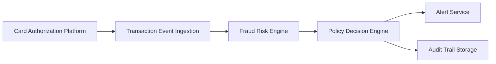

#### 1. High-Level Design

- **Summary**: This epic implements a real-time fraud detection system that ingests credit card transaction events, evaluates them using a risk-scoring engine with configurable thresholds, and triggers alerts for suspicious activity. The system processes multiple risk signals (unusual amounts, merchant behavior, geographic inconsistencies, velocity patterns, compromised-card indicators) to classify transactions into low, medium, or high-risk bands while minimizing false positives.

- **Component Flow**:

- **Integration Points**: 
  - **Upstream**: Card authorization/transaction platform (transaction event source)
  - **Downstream**: Fraud-risk engine/model (risk scoring), Policy/decision engine (risk-to-action mapping), Analytics and monitoring infrastructure, Audit infrastructure
  - **Fail-safe**: Policy engine executes fail-safe policy when risk engine is unavailable

- **Key Assumptions**: 
  - Transaction events arrive in a standardized format with all required risk signals (amount, merchant, location, velocity data)
  - Risk thresholds and alert rules are pre-configured and maintained by fraud operations team with appropriate tooling

- **NFR Highlights**: Risk evaluation and alert triggering must meet agreed transaction-time SLA; Support transaction spikes without unacceptable alert delays; High availability with defined disaster recovery for security-critical services; Apply encryption, secrets management, and least privilege access

- **Data Flow**: Transaction events flow from the card authorization platform to the ingestion layer, which applies idempotency handling for duplicates. Events are then passed to the fraud-risk engine for risk score evaluation based on multiple signals (amount, merchant, geography, velocity, compromised-card indicators). The risk score is sent to the policy/decision engine, which maps the score to risk bands (low/medium/high) using configurable thresholds and determines whether to trigger an alert. Alert decisions are routed to the alert service for customer notification, while all risk decisions and actions are recorded in the audit trail storage for compliance and investigation purposes.

#### 2. Validation Report

- **Requirements Coverage**: The design covers all core requirements specified in the epic scope:
  - ✅ Transaction event ingestion from authorization platform
  - ✅ Risk score evaluation using fraud-risk engine
  - ✅ Configurable alert threshold determination via policy engine
  - ✅ Risk signal processing (unusual amounts, merchant behavior, geographic inconsistencies, transaction velocity)
  - ✅ Idempotency handling for duplicate events (handled in ingestion layer)
  - ✅ Policy engine integration for risk-to-action mapping
  - ✅ Audit trail recording for all risk decisions
  - ✅ Fail-safe policy execution when risk engine unavailable
  - ✅ NFRs addressed: transaction-time SLA, spike handling, high availability, disaster recovery, encryption, secrets management, least privilege access, metrics/logs/traces/dashboards

- **Gap Analysis**: No significant gaps identified. All functional and non-functional requirements from the epic are addressed in the high-level design. The component architecture supports the required integrations, fail-safe mechanisms, and audit capabilities.

- **Compliance & Security Validation**:
  - ✅ Strong authentication and authorization enforced via least privilege access controls
  - ✅ Encryption applied to data in transit and at rest
  - ✅ Secrets management for credentials and API keys
  - ✅ Comprehensive audit trail for all risk decisions (regulatory compliance)
  - ✅ Idempotency and event versioning to prevent duplicate processing
  - ✅ Fail-safe policy ensures continued operation during risk engine outages
  - ✅ Operational observability via metrics, logs, traces, and dashboards

- **Recommendation**: The high-level design is ready to proceed to detailed technical design phase. Ensure that SLA targets for transaction-time risk evaluation are clearly defined and validated through performance testing. Confirm disaster recovery RTO/RPO targets with stakeholders before implementation.