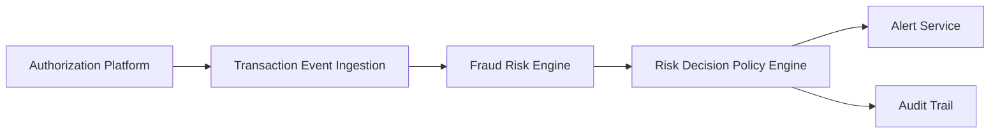

#### 1. High-Level Design

- **Summary**: This epic implements the core fraud detection engine that ingests credit card transaction events from the authorization platform, evaluates risk using multiple fraud signals (amount anomalies, merchant behavior, geographic inconsistencies, velocity patterns, compromised cards), applies configurable risk thresholds, and produces risk decisions (approve, alert, step-up, hold, decline) in near real-time to prevent unauthorized transactions while minimizing false positives.

- **Component Flow**:

- **Integration Points**: 
  - **Upstream**: Card authorization/transaction platform (transaction event source)
  - **Internal**: Fraud-risk engine/model, Policy/decision engine
  - **Downstream**: Analytics and audit infrastructure
  - **Stakeholders**: Security and compliance stakeholders

- **Key Assumptions**: 
  - Transaction events arrive in a standardized format with all required risk signals available; risk scoring engine responds within the transaction-time SLA budget to enable real-time decisioning.

- **NFR Highlights**: Risk evaluation must meet transaction-time SLA; support transaction spikes; high availability with disaster recovery; encrypt sensitive data in transit and at rest; apply least-privilege access to fraud and customer data.

#### 2. Validation Report

- **Requirements Coverage**: The design covers all stated scope including transaction ingestion, risk scoring, configurable thresholds, policy engine, idempotency, risk signal evaluation, risk classification, fail-safe handling, audit trail, and monitoring dashboards. All NFRs (SLA, scalability, HA/DR, security, encryption, access control, observability) are addressed through the component architecture.

- **Traceability**: Epic scope items map directly to components: ingestion service handles transaction events and idempotency; fraud-risk engine evaluates signals and classifies risk levels; policy engine applies thresholds and determines actions; audit trail captures risk decisions; monitoring dashboards provide operational visibility.

- **Gap Analysis**: No critical gaps identified. The design addresses core fraud detection, risk evaluation, policy decisioning, fail-safe behavior, and audit requirements. Out-of-scope items (ML model development, case management redesign, cross-product fraud, customer-facing model explanations) are appropriately excluded.

- **Risk & Mitigation**: 
  - **Risk**: Fraud-risk engine unavailability could block transactions. **Mitigation**: Fail-safe policy defined in scope to handle engine unavailability.
  - **Risk**: Transaction spikes may overwhelm risk evaluation. **Mitigation**: NFR explicitly requires support for transaction spikes without unacceptable delays; scalable architecture needed.
  - **Risk**: Duplicate events could trigger multiple alerts. **Mitigation**: Idempotency handling explicitly included in scope.

- **Compliance & Security**: Encryption in transit and at rest, least-privilege access, durable audit records, and security-critical service HA/DR requirements are explicitly stated. Design supports compliance through comprehensive audit trail and event versioning.