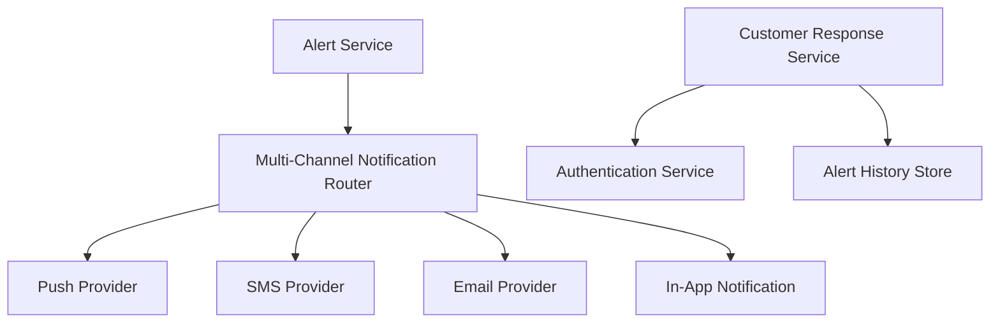

#### 1. High-Level Design

- **Summary**: This epic delivers the customer-facing fraud alert notification system that sends suspicious transaction alerts through multiple channels (push, SMS, email, in-app), presents transaction details securely, and enables customers to confirm legitimate transactions or report unauthorized activity. The system manages alert lifecycle states, handles delivery failures with fallback channels, respects customer preferences while enforcing security-critical alerts, and requires authentication for sensitive fraud-response actions.

- **Component Flow**:

- **Integration Points**: 
  - **Upstream**: Alert service (receives fraud alerts from risk evaluation engine)
  - **External**: Notification providers (push, SMS, email), Customer identity/authentication service
  - **Internal**: Customer response service, Alert history/state management
  - **Downstream**: Analytics and monitoring infrastructure
  - **Stakeholders**: Customer-support stakeholders

- **Key Assumptions**: 
  - Customer contact information (phone, email, device tokens) is available and current; notification providers meet delivery SLA requirements and support fallback mechanisms when primary channels fail.

- **NFR Highlights**: Near real-time notification delivery meeting agreed SLA; notification delivery success monitoring by channel; rate-limit sensitive endpoints; secure authentication before fraud-response actions; never display full card numbers; protect notification links from unauthorized access; cross-platform accessibility; retention and deletion policies compliant with legal/security requirements.

#### 2. Validation Report

- **Requirements Coverage**: The design covers all stated scope including multi-channel delivery (push, SMS, email, in-app), transaction detail presentation, confirm/report actions, alert state management, delivery status tracking, fallback handling, customer preferences, alert history, authenticated response capture, notification link security, alert grouping, and cross-platform accessibility. All NFRs (delivery SLA, monitoring, rate limiting, authentication, data masking, link security, accessibility, retention) are addressed.

- **Traceability**: Epic scope items map to components: notification router handles multi-channel delivery and fallback logic; alert service manages lifecycle states; customer response service captures authenticated actions; authentication service enforces security before sensitive operations; alert history store provides viewing and audit capabilities; notification providers enable push/SMS/email delivery.

- **Gap Analysis**: No critical gaps identified. The design addresses customer notification, multi-channel delivery with fallback, alert lifecycle management, customer response capture, authentication, and security requirements. Out-of-scope items (response time tracking, international regulatory workflows, fraud-model explanations) are appropriately excluded.

- **Risk & Mitigation**: 
  - **Risk**: Notification delivery failures could delay customer awareness. **Mitigation**: Fallback channel handling explicitly included in scope to ensure delivery through alternative channels.
  - **Risk**: Compromised accounts could disable fraud controls. **Mitigation**: Authentication and authorization required for sensitive fraud-response actions per scope.
  - **Risk**: Notification links could be exploited. **Mitigation**: Notification link security and deep link protection explicitly required in NFRs.

- **Compliance & Security**: Secure authentication before sensitive actions, no full card numbers in notifications, protected notification links, rate limiting, cross-platform accessibility, and legal/security-approved retention policies are explicitly stated. Design supports compliance through authenticated customer responses and secure notification delivery.