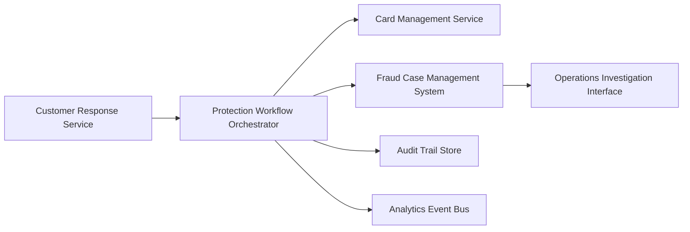

#### 1. High-Level Design

- **Summary**: This epic implements the security workflows triggered when customers report unauthorized transactions, executing immediate account protection actions (card blocking, replacement), creating fraud cases for investigation, and maintaining comprehensive audit trails. The system manages fraud case lifecycle, provides fraud analyst visibility for investigation, ensures protection workflows complete within operational SLAs, and captures detailed analytics events for compliance, dispute resolution, and fraud model improvement.

- **Component Flow**:

- **Integration Points**: 
  - **Upstream**: Customer response service (receives unauthorized transaction reports)
  - **External**: Card-management/protection service, Fraud case-management system, Customer identity/authentication service
  - **Internal**: Protection workflow orchestrator, Audit trail recording
  - **Downstream**: Analytics and audit infrastructure, Dispute initiation pathway
  - **Stakeholders**: Security, legal, and compliance stakeholders; Customer-support stakeholders

- **Key Assumptions**: 
  - Card-management service supports synchronous or near-synchronous blocking operations to meet protection SLA; fraud case-management system can accept automated case creation with sufficient context for analyst investigation.

- **NFR Highlights**: Complete unauthorized-report protection workflows within target operational SLA; high availability with disaster recovery for security-critical services; strong authentication, authorization, encryption, secrets management, and least privilege; log security events without unnecessarily storing sensitive payment data; retention and deletion policies approved by legal/security; zero critical security or privacy defects before GA; comprehensive metrics, logs, traces, and operational dashboards.

#### 2. Validation Report

- **Requirements Coverage**: The design covers all stated scope including unauthorized transaction reporting workflow, card/account protection action triggering, card blocking, fraud case creation and management, protection workflow completion tracking, operations investigation interface, comprehensive audit trail (alert creation, delivery, customer response, protection actions), fraud case status management, dispute initiation pathway, analytics event capture (all specified events), and operational monitoring for protection workflow success/failure. All NFRs (operational SLA, HA/DR, security controls, audit logging, retention policies, zero critical defects, observability) are addressed.

- **Traceability**: Epic scope items map to components: protection workflow orchestrator coordinates card blocking and case creation; card management service executes blocking actions; fraud case management system handles case lifecycle and status; operations investigation interface provides analyst visibility; audit trail store captures comprehensive event history; analytics event bus publishes all specified fraud events; monitoring dashboards track workflow success/failure.

- **Gap Analysis**: No critical gaps identified. The design addresses unauthorized transaction reporting, immediate account protection, fraud case management, analyst investigation, comprehensive audit trail, analytics event capture, and operational monitoring. Out-of-scope items (full case management redesign, cross-product fraud, international regulatory workflows, legal liability determination) are appropriately excluded.

- **Risk & Mitigation**: 
  - **Risk**: Protection workflow failures could leave accounts vulnerable. **Mitigation**: Operational SLA explicitly defined; operational monitoring for workflow success/failure included in scope; high availability with disaster recovery required.
  - **Risk**: Insufficient audit trail could impact compliance or dispute resolution. **Mitigation**: Comprehensive audit trail recording explicitly covers alert creation, delivery, customer response, and protection actions.
  - **Risk**: Security defects could compromise customer accounts. **Mitigation**: NFR requires zero critical security or privacy defects before general availability.

- **Compliance & Security**: Strong authentication, authorization, encryption, secrets management, least privilege, security event logging without unnecessary sensitive data storage, legal/security-approved retention and deletion policies, and zero critical security/privacy defects before GA are explicitly stated. Design supports compliance through comprehensive audit trail, analytics event capture, and traceable fraud case lifecycle management.