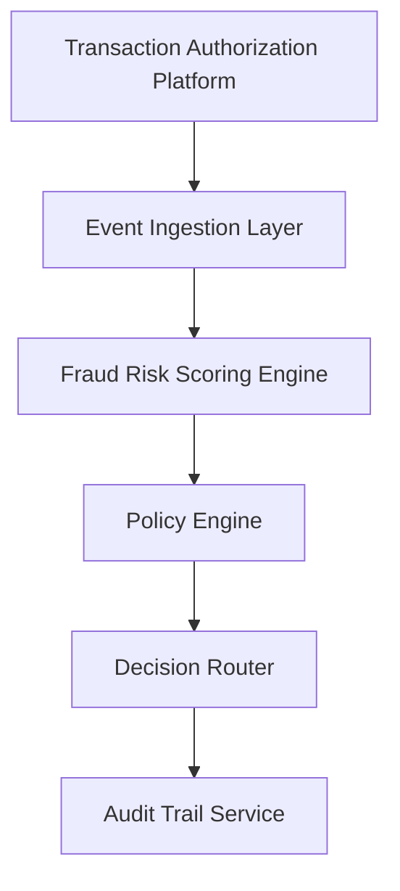

#### 1. High-Level Design

- **Summary**: This epic provides the foundational fraud detection capability that processes credit card transactions in near real-time, applies risk scoring models using multiple signals (transaction amount, merchant behavior, geographic inconsistencies, velocity patterns, compromised-card indicators), and maps risk decisions to actions (approve, alert, step-up verification, hold, decline). The system categorizes transactions into low, medium, high, and confirmed fraud levels to balance fraud prevention with customer experience.

- **Component Flow**:

- **Integration Points**: 
  - **Upstream**: Card authorization/transaction platform (transaction event source)
  - **Downstream**: Fraud-risk engine/model (risk scoring), Policy/decision engine (risk-to-action mapping), Analytics and audit services (operational event capture), Security and compliance infrastructure

- **Key Assumptions**: 
  - The fraud-risk engine is available as a service with defined SLA and provides risk scores in a format compatible with the policy engine
  - Configurable alert thresholds can be adjusted without code deployment to support operational tuning

- **NFR Highlights**: Risk evaluation and alert triggering must meet agreed transaction-time SLA for near-real-time processing; system must support transaction spikes without unacceptable alert delays; high availability required for security-critical services with defined disaster recovery

- **Data Flow**: Transaction events originate from the authorization platform and are ingested by the event ingestion layer, which handles deduplication via idempotency checks. Normalized transaction data with risk signals (amount anomalies, merchant category, geographic/device inconsistency, velocity, failed attempts, compromised-card indicators) is sent to the fraud-risk scoring engine. The engine returns a risk score and level (low, medium, high, confirmed fraud). The policy engine maps the risk level to an action decision, which the decision router executes. All decisions are logged to the audit trail service with model version tracking for compliance and operational analysis.

#### 2. Validation Report

- **Requirements Coverage**: The design comprehensively covers the epic's scope including transaction event ingestion, risk score evaluation, configurable threshold management, risk decision mapping, policy engine integration, idempotency handling, risk signal processing, audit trail recording, model version tracking, and fail-safe policy execution. NFRs are addressed through architectural patterns supporting near-real-time SLA, transaction spike handling, high availability with disaster recovery, strong authentication/authorization/encryption, idempotency/retries/event versioning for reliability, and observability through metrics/logs/traces/dashboards.