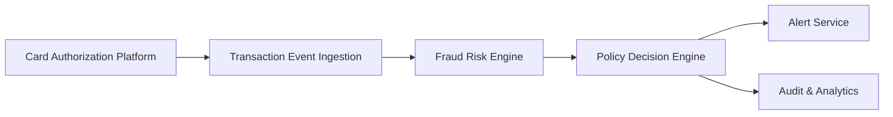

#### 1. High-Level Design

**Summary:** This epic establishes the core real-time fraud detection capability by ingesting credit card transaction events from the authorization platform, evaluating each transaction through a fraud-risk scoring engine using multiple fraud signals (amount anomalies, merchant categories, geographic inconsistencies, device risk, velocity patterns, known fraud indicators), and applying configurable risk thresholds to categorize transactions into low/medium/high risk bands with corresponding alert policies.

**Component Flow:**

**Integration Points:**
- **Upstream:** Card authorization/transaction platform (transaction event source)
- **Core:** Fraud-risk engine/model for risk scoring, Policy/decision engine for threshold mapping and risk-to-action rules
- **Downstream:** Analytics and audit infrastructure for event capture (fraud_alert_created, fraud_alert_failed), Operational monitoring dashboards
- **Governance:** Security and compliance stakeholders for policy approval

**Key Assumptions:**
- Transaction events arrive in a standardized format with required fraud signal attributes; risk engine response time is within transaction-time SLA budget.
- Risk threshold configurations and policy mappings are managed externally and provided to the policy engine via configuration service or admin interface.

**NFR Highlights:** Risk evaluation must meet agreed transaction-time SLA for near-real-time processing; support transaction spikes without unacceptable delays; high availability with disaster recovery; idempotency, retries, event versioning, durable audit records; encryption, secrets management, least privilege access.

#### 2. Validation Report

**Requirements Coverage:** The design covers all stated scope elements: transaction ingestion, risk evaluation, configurable thresholds, risk decision model with low/medium/high bands, policy mapping, idempotency, fail-safe for engine unavailability, audit trails, analytics events, and operational monitoring. The component flow shows clear separation of concerns between ingestion, risk scoring, policy decision, alerting, and audit/analytics.

**Traceability:**
- Transaction event ingestion → Transaction Event Ingestion component
- Risk score evaluation → Fraud Risk Engine component
- Configurable alert thresholds and risk decision model → Policy Decision Engine component
- Alert creation → Alert Service component
- Audit trail and analytics → Audit & Analytics component
- Idempotency, fail-safe, monitoring → Cross-cutting concerns in ingestion and policy layers

**Gap Analysis:** No significant gaps identified. The epic clearly defines scope, NFRs, and integration points. Fail-safe policy for risk engine unavailability is explicitly in scope, ensuring resilience.

**Risk & Compliance Notes:**
- Security: Encryption, secrets management, and least privilege are mandated NFRs.
- Compliance: Audit trail recording for all risk decisions ensures regulatory traceability.
- Operational: Monitoring dashboards for risk decision latency and error rates support SLA compliance and incident response.