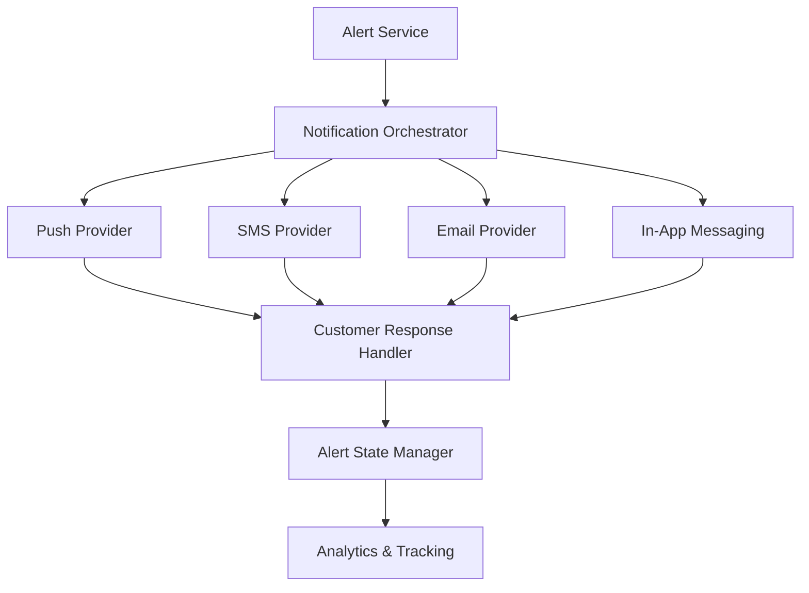

#### 1. High-Level Design

**Summary:** This epic delivers fraud alerts to cardholders via multiple channels (push, SMS, email, in-app) with sufficient transaction context (amount, merchant, timestamp, location, masked card, risk messaging) to enable immediate customer action. Customers can confirm legitimate transactions or report unauthorized activity, triggering state transitions across the alert lifecycle (created → queued → delivered → viewed → confirmed/reported → resolved/expired). The system includes intelligent fallback for channel failures, respects customer preferences (with security overrides), and handles edge cases like missing push tokens and provider unavailability.

**Component Flow:**

**Integration Points:**
- **Upstream:** Alert Service (canonical alert record creation from fraud detection epic)
- **External:** Notification providers (push/SMS/email delivery), Customer identity/authentication service (response validation)
- **Downstream:** Analytics infrastructure (fraud_alert_sent, fraud_alert_delivered, fraud_alert_viewed, fraud_alert_confirmed, fraud_alert_reported events)
- **Support:** Customer-support stakeholders for escalation handling

**Key Assumptions:**
- Notification providers expose standard APIs for delivery and status tracking; customer identity service provides authentication tokens for validating responses.
- Alert expiration timeouts and fallback channel priority are configurable per security policy; customer notification preferences are retrieved from a customer profile service.

**NFR Highlights:** Alert delivery must meet near-real-time SLA from transaction event to customer notification; track delivery success by channel/provider; handle provider unavailability with retry/fallback; strong authentication for customer responses; never display full card numbers; protect notification links; rate-limit sensitive endpoints; cross-platform accessibility.

#### 2. Validation Report

**Requirements Coverage:** The design addresses all scope elements: multi-channel delivery (push/SMS/email/in-app), transaction context display, customer confirmation and reporting actions, alert lifecycle state management, delivery status tracking and retry logic, fallback channel support, customer preference handling, alert viewing, expiration, authenticated response recording, delivery vs. fraud decision failure distinction, and alert grouping/prioritization. The component flow clearly separates notification orchestration, provider integration, customer response handling, and state management.

**Traceability:**
- Multi-channel notification delivery → Notification Orchestrator and provider components (Push, SMS, Email, In-App)
- Transaction context display → Alert Service provides data; Notification Orchestrator formats for each channel
- Customer confirmation/reporting actions → Customer Response Handler
- Alert state management → Alert State Manager
- Delivery status tracking, retry, fallback → Notification Orchestrator with provider feedback loops
- Customer preference handling → Notification Orchestrator (retrieves and applies preferences with security overrides)
- Alert expiration → Alert State Manager
- Authenticated response recording → Customer Response Handler with identity/authentication service integration
- Analytics events → Analytics & Tracking component

**Gap Analysis:** No significant gaps. The epic explicitly handles edge cases (no push tokens, offline customers, duplicate notifications, provider unavailability) and defines clear lifecycle states. Fallback mechanisms and retry logic are in scope.

**Risk & Compliance Notes:**
- Security: Strong authentication for customer responses; never display full card numbers; protect notification links from unauthorized actions; rate-limiting to reduce abuse.
- Privacy: Masked card identifiers in notifications; secure transmission of alert details.
- Operational: Delivery success tracking by channel/provider enables SLA monitoring and provider performance evaluation.