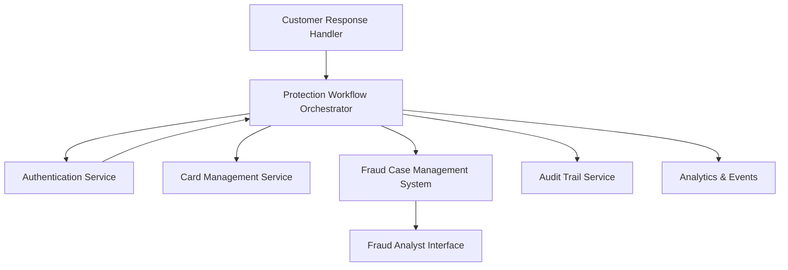

#### 1. High-Level Design

**Summary:** This epic implements critical security workflows activated when a customer reports a transaction as unauthorized. Upon receiving a 'Not me' response, the system initiates the approved protection workflow: blocking the card, securing the account, triggering card replacement, and creating fraud investigation cases. All protection actions require appropriate authentication (with step-up for high-risk scenarios) to prevent compromised accounts from disabling security controls. The system maintains complete audit trails, tracks fraud cases from creation through resolution, provides fraud analyst visibility, and ensures protection workflows complete within target operational SLAs.

**Component Flow:**

**Integration Points:**
- **Upstream:** Customer Response Handler (from multi-channel alert epic, receives 'Not me' responses)
- **Core:** Card-management/protection service (blocking and replacement), Fraud case-management system (investigation and dispute tracking), Customer identity/authentication service (step-up authentication)
- **Downstream:** Analytics infrastructure (fraud_alert_reported, fraud_protection_started, fraud_protection_completed events)
- **Governance:** Legal, compliance, and security stakeholders (policy approval), Customer-support teams (escalation handling)

**Key Assumptions:**
- Card-management service exposes APIs for blocking, securing, and initiating replacement; fraud case-management system accepts case creation requests with alert context.
- Protection workflow SLA targets and step-up authentication thresholds are defined by security policy and configurable; audit retention policies are approved by legal/security teams.

**NFR Highlights:** Complete unauthorized-report protection workflows within target operational SLA; minimize and monitor time to protection; strong authentication with step-up for high-risk scenarios; least-privilege access to fraud and customer data; log security events without storing sensitive payment data; encrypt data in transit and at rest; apply retention/deletion policies; high availability for security-critical services.

#### 2. Validation Report

**Requirements Coverage:** The design covers all stated scope: unauthorized transaction reporting workflow, card blocking and account security actions, card replacement initiation, fraud case creation and tracking, protection workflow state management, authentication/authorization for sensitive actions, fraud analyst investigation interface, alert outcome visibility, protection action completion tracking, audit trail retention, case-management integration for dispute initiation, step-up authentication for compromised accounts, and protection workflow SLA monitoring. The component flow shows clear orchestration of protection actions with authentication gates, card management, case creation, audit logging, and analyst visibility.

**Traceability:**
- Unauthorized transaction reporting workflow → Customer Response Handler triggers Protection Workflow Orchestrator
- Card blocking and account security actions → Card Management Service
- Card replacement process initiation → Card Management Service
- Fraud case creation and tracking → Fraud Case Management System
- Protection workflow state management → Protection Workflow Orchestrator
- Authentication and authorization for sensitive actions → Authentication Service with step-up capability
- Fraud operations analyst investigation interface → Fraud Analyst Interface
- Alert outcome visibility → Fraud Analyst Interface queries Fraud Case Management System
- Protection action completion tracking → Protection Workflow Orchestrator with status updates to Analytics & Events
- Audit trail retention → Audit Trail Service
- Case-management integration for dispute initiation → Fraud Case Management System
- Step-up authentication for compromised accounts → Authentication Service validates risk level and enforces step-up
- Protection workflow SLA monitoring → Analytics & Events component tracks timestamps

**Gap Analysis:** No significant gaps. The epic explicitly addresses authentication requirements to prevent compromised accounts from disabling security controls, includes step-up authentication for high-risk scenarios, and mandates audit trails for all protection actions. SLA monitoring is in scope.

**Risk & Compliance Notes:**
- Security: Strong authentication with step-up for high-risk scenarios; least-privilege access; encryption in transit and at rest; secrets management; high availability for security-critical services.
- Compliance: Audit trail retention for all security actions with approved retention/deletion policies; logging without unnecessarily storing sensitive payment data.
- Operational: Protection workflow SLA monitoring ensures timely response to unauthorized reports; time to protection is minimized and monitored to reduce customer exposure.
- Legal: Dispute initiation integrated with case management; legal/compliance/security stakeholders approve policies; out of scope clarifies no legal advice or liability determination.