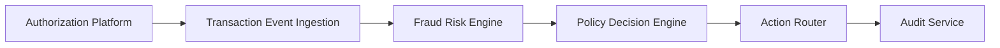

#### 1. High-Level Design

- **Summary**: This epic delivers the core fraud detection system that ingests credit card transaction events from the authorization platform, evaluates risk using a fraud-risk engine with multiple signals (amount patterns, merchant behavior, geographic inconsistencies, velocity, compromised-card indicators), and determines actions (approve, alert, step-up verify, hold, decline) based on configurable thresholds. Risk levels include low, medium, high, and confirmed fraud with corresponding treatments.

- **Component Flow**:

- **Integration Points**: 
  - **Upstream**: Card authorization/transaction platform (source of transaction events)
  - **Downstream**: Policy/decision engine (risk-to-action mapping), Analytics and audit infrastructure (operational events and audit trails), Security and compliance infrastructure

- **Key Assumptions**: 
  - Transaction events arrive in a standardized format from the authorization platform with all required risk signals available
  - Fraud-risk engine provides synchronous or near-synchronous scoring responses within the transaction-time SLA

- **NFR Highlights**: Risk evaluation and alert triggering must meet agreed transaction-time SLA for near-real-time processing; high availability for security-critical services with defined disaster recovery; support transaction spikes without unacceptable alert delays

- **Data Flow**: Transaction events flow from the authorization platform to the ingestion layer, which validates and deduplicates events using idempotency handling. The fraud-risk engine receives normalized transaction data and evaluates risk scores using multiple signals. Risk scores are passed to the policy decision engine, which maps them to actions (approve, alert, step-up, hold, decline) based on configurable thresholds. The action router executes the determined action and sends audit records to the audit service for compliance tracking.

#### 2. Validation Report

- **Requirements Coverage**: The design covers all stated scope including transaction ingestion, risk scoring, threshold management, policy integration, idempotency, fail-safe handling, audit trails, and risk signal processing. NFRs for near-real-time SLA, high availability, security (authentication, authorization, encryption, least privilege), reliability (idempotency, retries, event versioning), and observability (metrics, logs, traces, dashboards) are addressed through the component architecture and integration points.