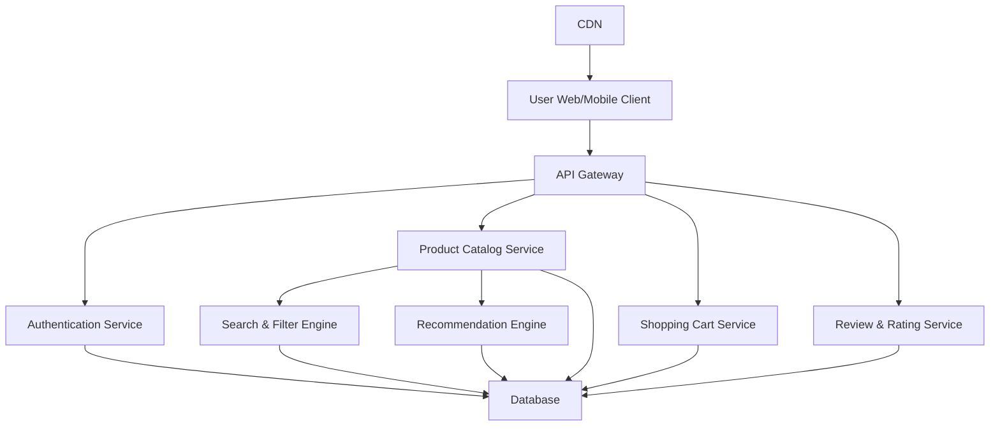

#### 1. High-Level Design

- **Summary**: This epic delivers the core consumer-facing product discovery platform enabling users to register, authenticate, browse a comprehensive product catalog with advanced search/filtering, manage shopping carts, view reviews/ratings, and receive personalized recommendations. The solution provides a responsive, accessible interface across web and mobile devices to help consumers find products quickly and make informed purchasing decisions.

- **Component Flow**:

- **Integration Points**: 
  - Cloud hosting and CDN services for content delivery and static asset distribution
  - Email notification providers for registration confirmation and user communications
  - Third-party authentication services (OAuth providers like Google, Facebook if applicable)
  - External recommendation engine or ML service for personalized product suggestions

- **Key Assumptions**: 
  - Product catalog data is pre-populated and maintained by sellers through separate admin interfaces
  - User session management follows standard JWT/token-based authentication with configurable timeout periods

- **NFR Highlights**: Page load times <2 seconds for 95% of requests; support 100,000 concurrent users with horizontal scaling; 99.9% uptime SLA; WCAG 2.1 AA accessibility compliance; keyboard and screen reader accessible

- **Data Flow**: Users authenticate via the Authentication Service, which validates credentials against the Database and issues session tokens. Product browsing requests flow through the API Gateway to the Product Catalog Service, which queries the Database and leverages the Search & Filter Engine for advanced queries. The Recommendation Engine analyzes user behavior and product data to generate personalized suggestions. Shopping cart operations are managed by the Shopping Cart Service with real-time state persistence. Reviews and ratings are retrieved from the Review & Rating Service. Static assets (images, CSS, JS) are served via CDN to optimize load times. All services interact with a centralized Database for data persistence and consistency.

#### 2. Validation Report

- **Requirements Coverage**: The high-level design fully covers the epic's stated scope including user registration/authentication, product catalog with search/filtering, shopping cart, reviews/ratings, wishlist, responsive design, and personalized recommendations. All identified NFRs (performance, scalability, accessibility, uptime) are addressed through appropriate architectural patterns (API Gateway for routing, separate microservices for scalability, CDN for performance, horizontal scaling capability). Integration points align with stated dependencies. The component architecture supports the required concurrent user load and performance targets while maintaining separation of concerns for maintainability and independent scaling.