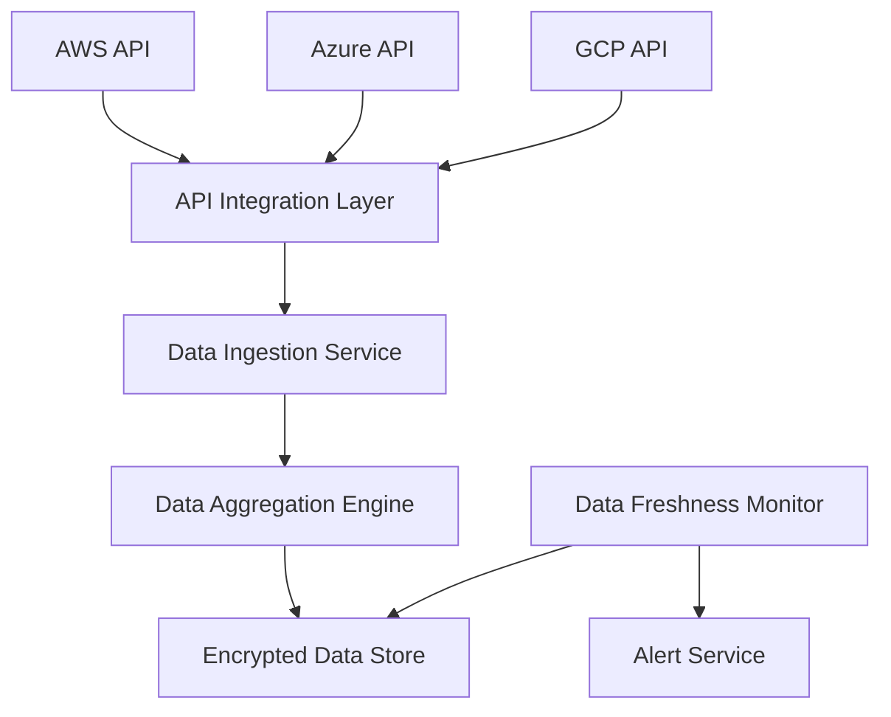

#### 1. High-Level Design

- **Summary**: This epic enables automated collection, aggregation, and synchronization of AI usage and spend data from major cloud providers (AWS, Azure, GCP) across all portfolio companies. It provides real-time visibility into AI technology adoption with automated data freshness monitoring and alerting for data older than 24 hours.

- **Component Flow**:

- **Integration Points**: 
  - Upstream: AWS, Azure, and GCP cloud provider APIs for AI service usage and cost data
  - Downstream: Dashboard Visualization and Analytics epic (QE-4579) as primary data consumer
  - Internal: Alert Service for data freshness notifications
  - External: Portfolio companies must enable cloud provider API access

- **Key Assumptions**: 
  - Cloud provider APIs provide standardized cost and usage data with consistent schemas that can be normalized
  - Data synchronization occurs on a scheduled basis (e.g., hourly) with incremental updates to minimize API calls and costs

- **NFR Highlights**: Dashboard loads within 3 seconds for up to 50 companies; supports 1000 concurrent users; TLS 1.2+ and AES-256 encryption; 99.5% uptime with automated failover and daily backups; scales to 200 companies

- **Data Flow**: The API Integration Layer establishes secure connections to AWS, Azure, and GCP APIs using authenticated credentials provided by portfolio companies. The Data Ingestion Service pulls usage metrics, cost data, and AI service consumption patterns on a scheduled basis. The Data Aggregation Engine normalizes and consolidates data across providers and companies, then stores it in the Encrypted Data Store. The Data Freshness Monitor continuously checks data timestamps and triggers the Alert Service when data exceeds 24 hours old. Aggregated data is made available to downstream analytics and visualization services.

#### 2. Validation Report

- **Requirements Coverage**: The design fully addresses the epic's scope including integration with all three major cloud providers (AWS, Azure, GCP), automated data ingestion and synchronization, real-time aggregation across portfolio companies, data freshness monitoring with 24-hour alerting, support for 50 companies initially, and encryption in transit and at rest. All NFRs (3s load time, 1000 concurrent users, encryption standards, 99.5% uptime, scalability to 200 companies) are incorporated through appropriate architectural patterns (API integration layer, scheduled ingestion, monitoring service). The design correctly excludes out-of-scope items (on-premise platforms, niche AI platforms, direct AI model management, custom AI development).