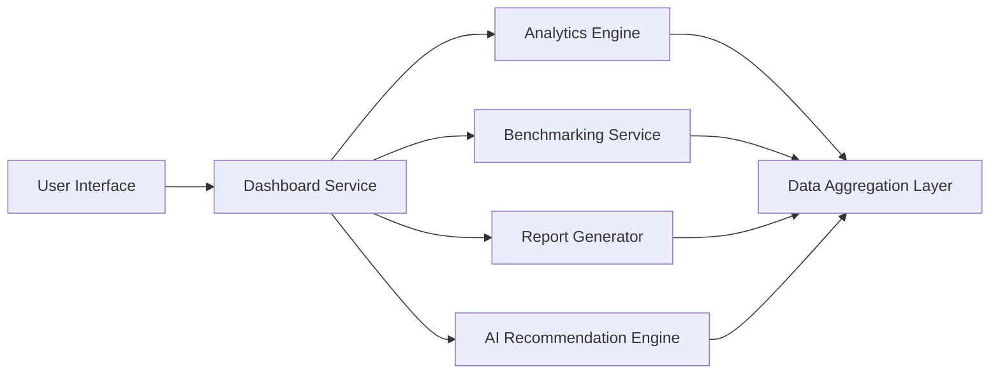

#### 1. High-Level Design

- **Summary**: This epic delivers a comprehensive dashboard interface for visualizing AI usage and spend data across the portfolio. It provides consolidated views, customizable widgets, drill-down analytics, benchmarking tools, executive reporting, and AI-driven cost optimization recommendations. Users can analyze portfolio-wide metrics, compare companies, and export reports in multiple formats.

- **Component Flow**:

- **Integration Points**: 
  - Upstream: AI Data Integration and Aggregation epic (QE-4578) for underlying usage and spend data
  - Upstream: Cloud provider APIs (AWS, Azure, GCP) for real-time data
  - Downstream: Export services for PDF and Excel report generation
  - Internal: Alert notification system for budget threshold breaches

- **Key Assumptions**: 
  - Industry benchmark data is available from external data sources or calculated from anonymized portfolio aggregates
  - Cost optimization recommendations use rule-based algorithms initially, with ML enhancement in future releases

- **NFR Highlights**: Dashboard loads within 3 seconds (95th percentile); report generation completes within 10 seconds; budget alerts sent within 5 minutes; WCAG 2.1 AA accessibility compliance; supports 1000 concurrent users

- **Data Flow**: The User Interface sends requests to the Dashboard Service, which orchestrates calls to the Analytics Engine for drill-down analysis, Benchmarking Service for cross-company comparisons, Report Generator for exports, and AI Recommendation Engine for cost optimization insights. All services query the Data Aggregation Layer, which provides unified access to portfolio-wide AI usage and spend data. Generated reports and alerts are delivered back to users through the UI or notification channels.

#### 2. Validation Report

- **Requirements Coverage**: The design comprehensively covers all functional requirements including consolidated dashboard views, customizable widgets, drill-down analytics, benchmarking, automated alerts, report exports, and AI-driven recommendations. NFRs for performance (3s page load, 10s report generation), accessibility (WCAG 2.1 AA), and scalability (1000 concurrent users) are addressed through dedicated service architecture and caching strategies. The design correctly excludes out-of-scope items (custom AI development, multi-currency, multi-language support in initial release).