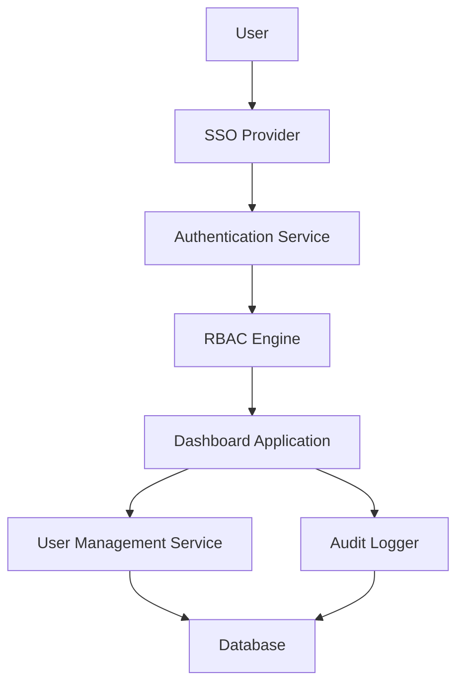

#### 1. High-Level Design

- **Summary**: This epic establishes comprehensive security controls and user access management for the AI Portfolio Management Dashboard. It implements role-based access control (RBAC), SSO integration, user lifecycle management (provisioning, de-provisioning, lockout recovery), audit logging, and data privacy controls to protect sensitive portfolio company information.

- **Component Flow**:

- **Integration Points**: 
  - Upstream: Existing SSO provider for authentication
  - Upstream: User management systems for provisioning workflows
  - Internal: Dashboard application for access control enforcement
  - Internal: Audit logging system for compliance tracking

- **Key Assumptions**: 
  - SSO provider supports SAML 2.0 or OAuth 2.0 protocols for integration
  - User attributes (role, company assignments) are maintained in an internal user directory synchronized with SSO

- **NFR Highlights**: All data encrypted with TLS 1.2+ (transit) and AES-256 (at rest); 99.5% uptime; user lockout recovery within 2 minutes; supports 1000 concurrent users; immediate logging of unauthorized access attempts

- **Data Flow**: Users authenticate via SSO provider, which returns authentication tokens to the Authentication Service. The RBAC Engine validates user permissions based on role and portfolio company assignments stored in the Database. The Dashboard Application enforces access controls for data visibility. All access attempts and administrative actions are captured by the Audit Logger and persisted to the Database for compliance reporting.

#### 2. Validation Report

- **Requirements Coverage**: The design fully addresses the epic's stated scope including RBAC implementation, SSO integration, user lifecycle management, audit logging, and data privacy controls. All NFRs (encryption, uptime, response times, concurrency) are incorporated into the architecture through dedicated components (Authentication Service, RBAC Engine, Audit Logger). The design excludes out-of-scope items (custom authentication, biometric auth, advanced threat detection) as specified.