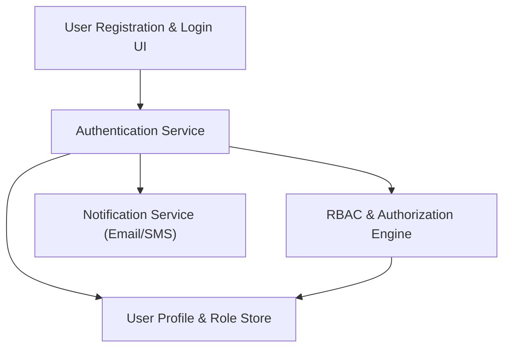

#### 1. High-Level Design
- Summary: Implement full user lifecycle management for buyers, sellers, and admins, including registration, authentication, role-based access control, email confirmation, session management, and account lockout.
- Component Flow:

- Integration Points: Email/SMS providers for confirmations; cloud hosting for user data; optional third-party authentication services.
- Key Assumptions:
  - Role definitions for consumers, sellers, and admins are centrally managed in the profile store.
  - Session management supports both web and mobile clients, sharing the same authentication backend.
- NFR Highlights: Encryption in transit and at rest; PCI DSS compliance for payment-related data; fraud detection and account lockout; support 100,000 concurrent users; 99.9% uptime; WCAG 2.1 AA accessibility.

#### 2. Validation Report
- Requirements Coverage: The design provides robust registration, authentication, role management, email workflows, sessions, and lockout mechanisms, complying with the epic’s functional and non-functional requirements.
