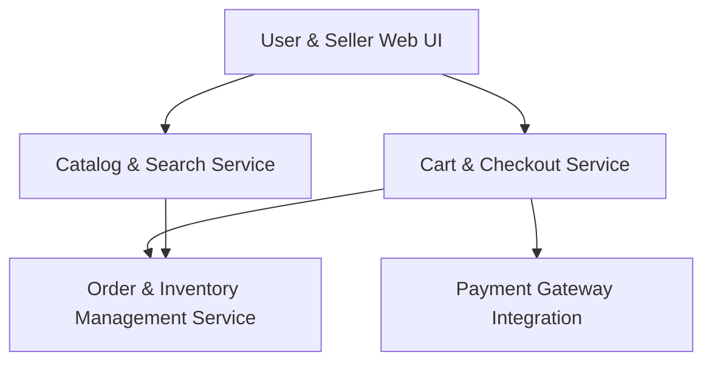

#### 1. High-Level Design
- Summary: Provide product browsing, discovery, cart, secure checkout, payment integration, order tracking, seller listing and inventory management, reviews/ratings, and refund processing for an online shopping platform.
- Component Flow:

- Integration Points: Third-party payment gateway APIs; cloud hosting/CDN for images and content; logistics APIs for shipping updates; email/SMS for confirmations and status updates.
- Key Assumptions:
  - Seller dashboard features are hosted within the same web application, backed by order/inventory services.
  - Refunds and cancellations are processed through integrations with payment gateways and logistics partners.
- NFR Highlights: 2s page load for 95% of requests; checkout within 5s; support 10,000 transactions/minute; encryption; PCI DSS compliance; automated failover/backup; recovery within 30 minutes.

#### 2. Validation Report
- Requirements Coverage: The component model supports catalog, search, cart, checkout, payment, order tracking, seller functions, and refunds under the described performance and security constraints.
