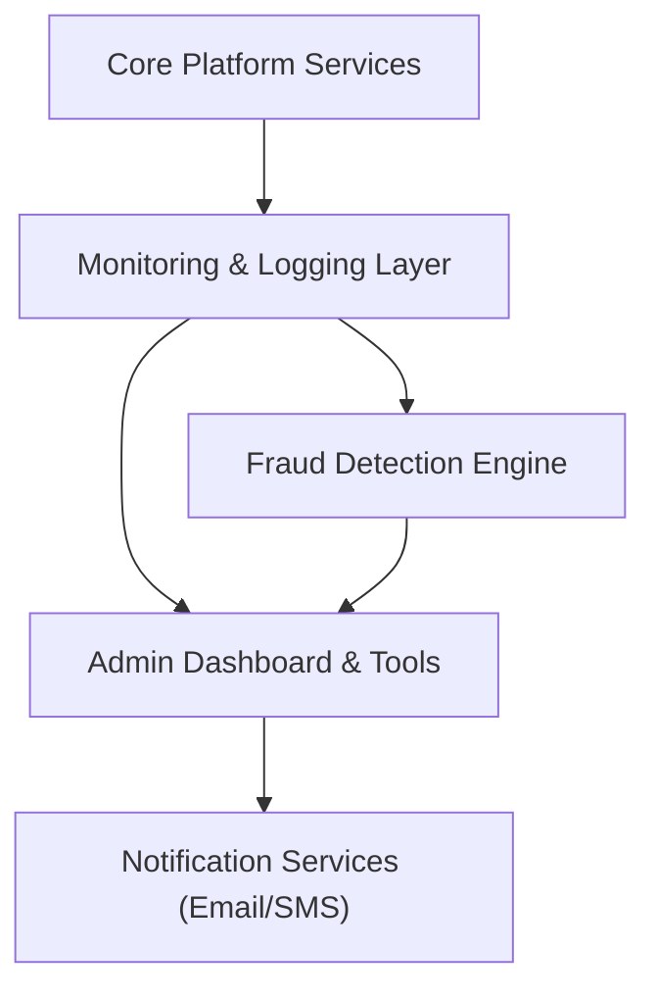

#### 1. High-Level Design
- Summary: Deliver an admin dashboard and tools for system health monitoring, user management, fraud detection, dispute resolution, compliance oversight, and performance/security monitoring.
- Component Flow:

- Integration Points: Cloud hosting for analytics; email/SMS providers; monitoring/logging services; fraud detection algorithms/services; compliance audit tools.
- Key Assumptions:
  - Admin dashboard consumes analytics and monitoring data from a unified telemetry pipeline.
  - Fraud detection combines automated algorithms with manual review workflows within the admin UI.
- NFR Highlights: Support 100,000 concurrent users; 99.9% uptime; automated failover; full encryption; WCAG 2.1 AA; automated backups; fraud detection capabilities.

#### 2. Validation Report
- Requirements Coverage: The design addresses analytics, user/permission management, fraud handling, disputes, compliance, and monitoring with appropriate NFR support, aligning well with the epic scope.
