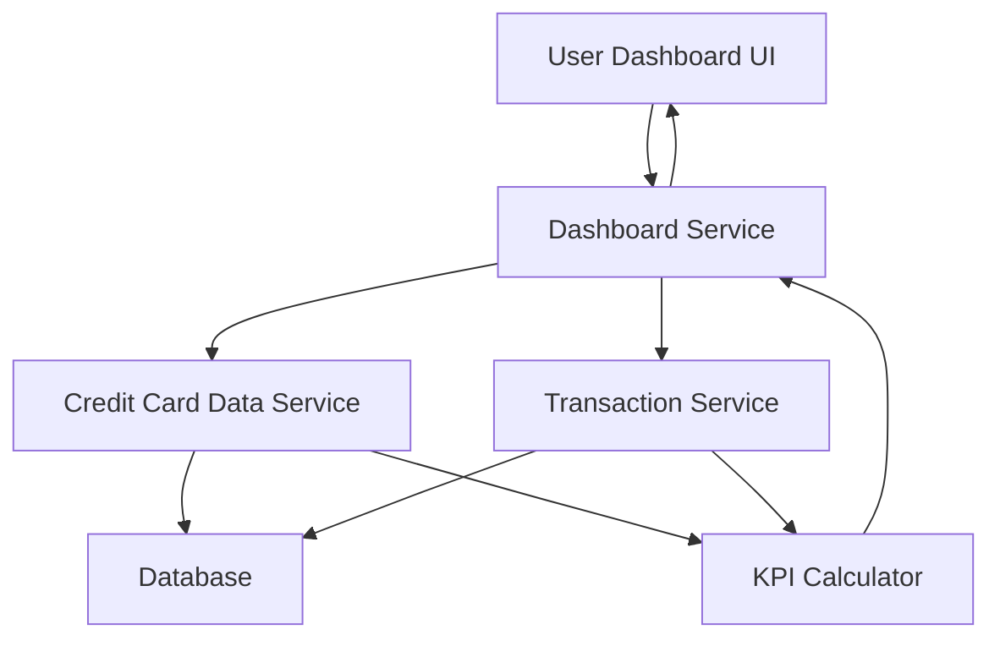

#### 1. High-Level Design

- **Summary:** This epic delivers a consolidated dashboard that displays key performance indicators (KPIs) for users' credit card portfolios. The core requirement is to aggregate and present monthly spend, total credit limit, available credit, and outstanding amounts across multiple credit cards in a single, responsive interface. The scope includes real-time KPI calculations and multi-card portfolio management.

- **Component Flow:**

- **Integration Points:** 
  - **Upstream:** Credit card data service (for card details, limits, balances); Transaction service (for monthly spend and outstanding amount calculations)
  - **Downstream:** User Dashboard UI (web/mobile responsive interface)

- **Key Assumptions:** 
  - Credit card data and transaction data are available via REST APIs with sub-second response times
  - KPI calculations (available credit, outstanding amounts) follow standard credit card accounting rules (credit limit minus current balance)

- **NFR Highlights:** Dashboard must be responsive across devices; KPI calculations must be accurate and real-time; System must support viewing multiple credit cards simultaneously

- **Data Flow:** User requests dashboard view → Dashboard Service orchestrates calls to Credit Card Data Service (retrieves card details, limits, current balances) and Transaction Service (retrieves monthly transactions) → KPI Calculator aggregates data to compute monthly spend, total credit limit (sum across cards), available credit (limit minus balance), and outstanding amounts → Computed KPIs are returned to Dashboard Service → Dashboard UI renders consolidated view with all KPIs and multi-card details in responsive format.

#### 2. Validation Report

- **Requirements Coverage:** The design fully covers the epic's stated scope including dashboard KPIs display, monthly spend tracking, total credit limit aggregation, available credit calculation, outstanding amount display, multiple credit card view, and consolidated interface. The architecture addresses all NFRs: responsive design through UI layer, real-time accuracy through direct service integration and KPI calculator, and multi-card support through aggregation logic. All dependencies (credit card data service, transaction service) are incorporated as integration points. Out-of-scope items (real bank integration, payments, transfers, loans, payment gateway) are correctly excluded from the design.