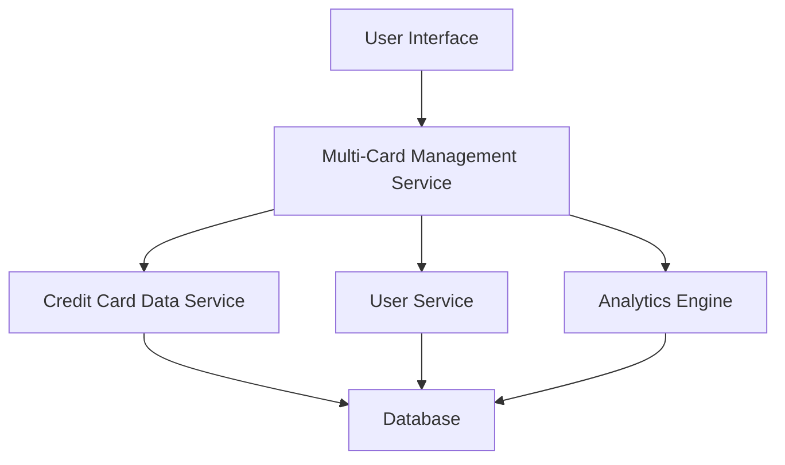

#### 1. High-Level Design

- **Summary**: This epic delivers a multi-card management interface that allows users to view, compare, and monitor multiple credit cards within a single consolidated dashboard. The solution provides card-wise information display, spend analysis, and comparison capabilities to simplify portfolio management for users with multiple credit card accounts.

- **Component Flow**:

- **Integration Points**: 
  - **Upstream**: Credit Card Data Service (provides card information and metadata); User Service (associates cards with user accounts)
  - **Downstream**: User Interface layer consuming consolidated card data; Analytics Engine for card-wise spend analysis

- **Key Assumptions**: 
  - Card data is pre-categorized and stored in a standardized format accessible via the Credit Card Data Service
  - User-to-card associations are maintained and validated by the User Service with appropriate authorization checks

- **NFR Highlights**: System must support unlimited number of credit cards per user; Card data retrieval must be optimized for performance with multiple cards

- **Data Flow**: User requests card portfolio view → Multi-Card Management Service authenticates via User Service → Service retrieves all associated cards from Credit Card Data Service → Spend data aggregated by Analytics Engine → Consolidated card list with metadata, balances, and spend analysis returned to UI → User can compare and monitor cards in a single interface

#### 2. Validation Report

- **Requirements Coverage**: The design fully covers the epic's stated scope including multiple credit card display, card-wise information view, card-wise spend analysis, card comparison capabilities, and consolidated card listing. The architecture addresses the NFRs for unlimited card support and optimized data retrieval. Integration with specified dependencies (Credit Card Data Service and User Service) is incorporated. The out-of-scope items (real bank integration, payments, transfers, loans, payment gateway) are explicitly excluded from the design.