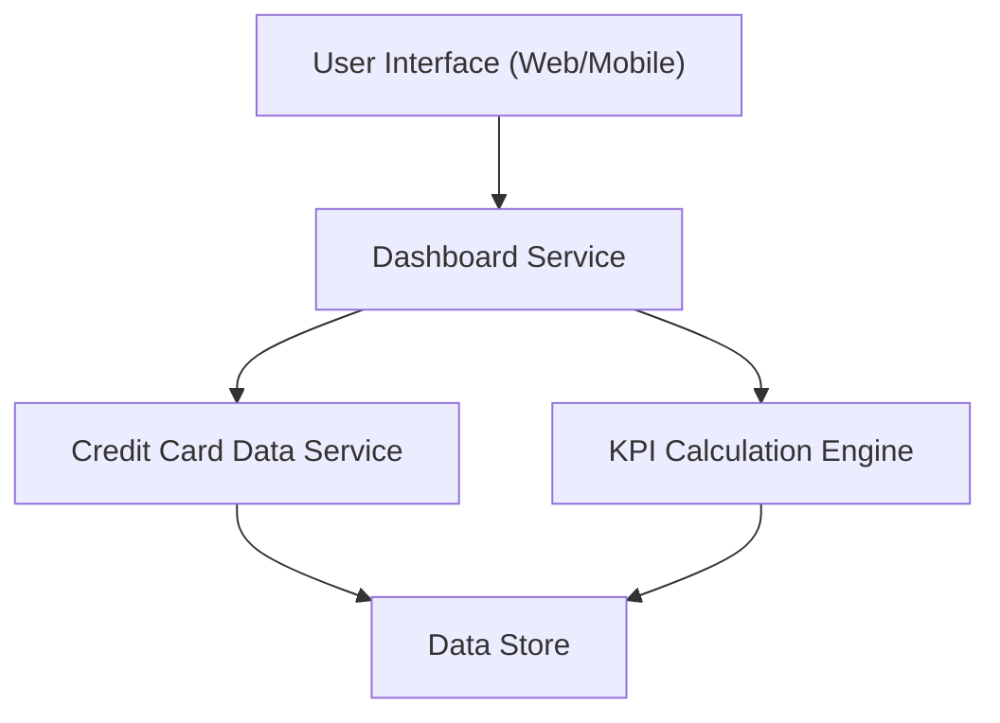

#### 1. High-Level Design

- **Summary:** This epic delivers a consolidated dashboard that displays key credit card portfolio metrics including monthly spend, total credit limit, available credit, and outstanding amounts. The solution provides users with a responsive interface for real-time financial health monitoring across all their credit cards.

- **Component Flow:**

- **Integration Points:** 
  - Upstream: Credit Card Data Service (provides card balances, limits, and transaction data)
  - Downstream: User Interface layer (web and mobile clients)

- **Key Assumptions:** 
  - KPI calculations are performed server-side with caching to optimize performance
  - Credit card data is refreshed at regular intervals (assumed near real-time or periodic sync)

- **NFR Highlights:** Dashboard must be responsive across desktop, tablet, and mobile devices; Page load time must support real-time KPI updates

- **Data Flow:** User requests dashboard → Dashboard Service fetches data from Credit Card Data Service → KPI Calculation Engine aggregates monthly spend, calculates available credit (limit - outstanding), and computes totals across all cards → Processed KPIs are returned to UI layer → Dashboard renders responsive visualizations showing financial health metrics

#### 2. Validation Report

- **Requirements Coverage:** The design fully covers the epic's scope including dashboard interface, all specified KPIs (monthly spend, total credit limit, available credit, outstanding amount), and responsive layout requirements. The architecture supports the stated NFRs for responsiveness and real-time updates through separation of concerns between data retrieval, calculation, and presentation layers.