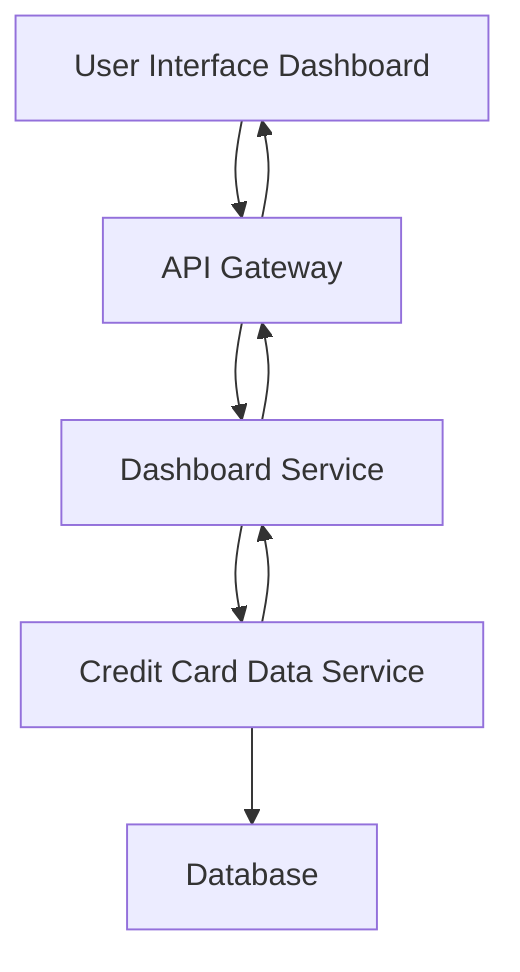

#### 1. High-Level Design

- **Summary:** This epic delivers a consolidated dashboard that displays key credit card portfolio metrics including monthly spend, total credit limit, available credit, and outstanding amounts. The solution provides a responsive interface for users to monitor their credit card financial health across all cards from a single view.

- **Component Flow:**

- **Integration Points:** 
  - Downstream: Credit card data service (for retrieving card balances, limits, and transaction data)
  - No upstream systems explicitly mentioned in the epic

- **Key Assumptions:** 
  - KPI calculations (monthly spend, available credit) are performed by the backend service rather than client-side
  - Real-time updates refer to near-real-time (within seconds) rather than sub-second latency

- **NFR Highlights:** Dashboard must be responsive across desktop, tablet, and mobile devices; Page load time must support real-time KPI updates

- **Data Flow:** User accesses the dashboard through the UI, which sends requests via API Gateway to the Dashboard Service. The Dashboard Service queries the Credit Card Data Service to retrieve card balances, limits, and transaction data from the Database. The aggregated KPI data (monthly spend, total credit limit, available credit, outstanding amounts) is calculated and returned through the API Gateway to render on the responsive dashboard interface.

#### 2. Validation Report

- **Requirements Coverage:** The design fully covers the epic's stated scope including dashboard interface, all four KPIs (monthly spend, total credit limit, available credit, outstanding amount), responsive layout, and integration with the credit card data service. The architecture supports the NFR requirements for responsiveness and real-time updates.