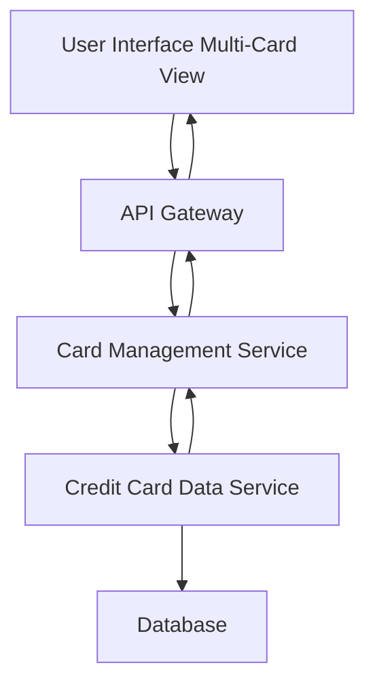

#### 1. High-Level Design

- **Summary:** This epic enables users to manage and view multiple credit cards within a unified interface. Users can track card-specific information including individual limits, balances, and usage patterns, with functionality to compare cards and analyze card-wise spending from a consolidated view.

- **Component Flow:**

- **Integration Points:** 
  - Downstream: Credit card data service (to fetch card details and balances for multiple cards)
  - No upstream systems explicitly mentioned in the epic

- **Key Assumptions:** 
  - The system will support a reasonable upper limit of cards per user (e.g., up to 20-30 cards) without performance degradation
  - Card comparison functionality uses client-side rendering with data fetched in a single API call

- **NFR Highlights:** System must support viewing and managing multiple credit cards simultaneously; Interface must maintain performance with increasing number of cards

- **Data Flow:** User accesses the multi-card management interface, which requests card portfolio data through the API Gateway to the Card Management Service. The service queries the Credit Card Data Service to retrieve details, balances, and usage patterns for all user cards from the Database. The aggregated multi-card data is returned and displayed in the UI, enabling users to view individual card details, perform card-wise spend analysis, and compare cards side-by-side.

#### 2. Validation Report

- **Requirements Coverage:** The design addresses all scope items including multiple credit card display, card-wise spend analysis, individual card details view, and card comparison functionality. The architecture supports scalability for multiple cards as specified in the NFRs and properly integrates with the credit card data service dependency.