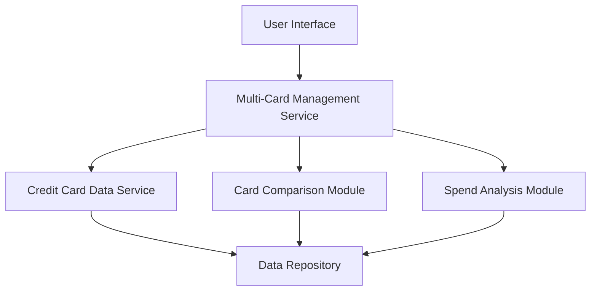

#### 1. High-Level Design

- **Summary:** This epic provides users with the ability to manage and visualize multiple credit cards within a unified interface. Users can view all cards with their details, perform card-wise spend analysis, compare cards, and track individual card limits, balances, and usage patterns.

- **Component Flow:**

- **Integration Points:** 
  - Upstream: Credit Card Data Service (fetches card details and balances for multiple cards)
  - Downstream: User Interface for card display and comparison features

- **Key Assumptions:** 
  - Card data is normalized and standardized across different card types for consistent display
  - System supports scalable card portfolio (performance maintained as number of cards increases)

- **NFR Highlights:** System must support viewing and managing multiple credit cards simultaneously; Interface must maintain performance with increasing number of cards

- **Data Flow:** User accesses multi-card view → Multi-Card Management Service requests card portfolio from Credit Card Data Service → Service retrieves all cards associated with user from Data Repository → Card Comparison Module and Spend Analysis Module process card-specific metrics → Aggregated card data with individual details, balances, and usage patterns is returned → UI renders unified view with card comparison and analysis capabilities

#### 2. Validation Report

- **Requirements Coverage:** The design addresses all scope elements including multiple credit card display, card-wise spend analysis, individual card details view, and card comparison functionality. The modular architecture with dedicated comparison and analysis modules ensures scalability as specified in NFRs, supporting performance maintenance with increasing card volumes.