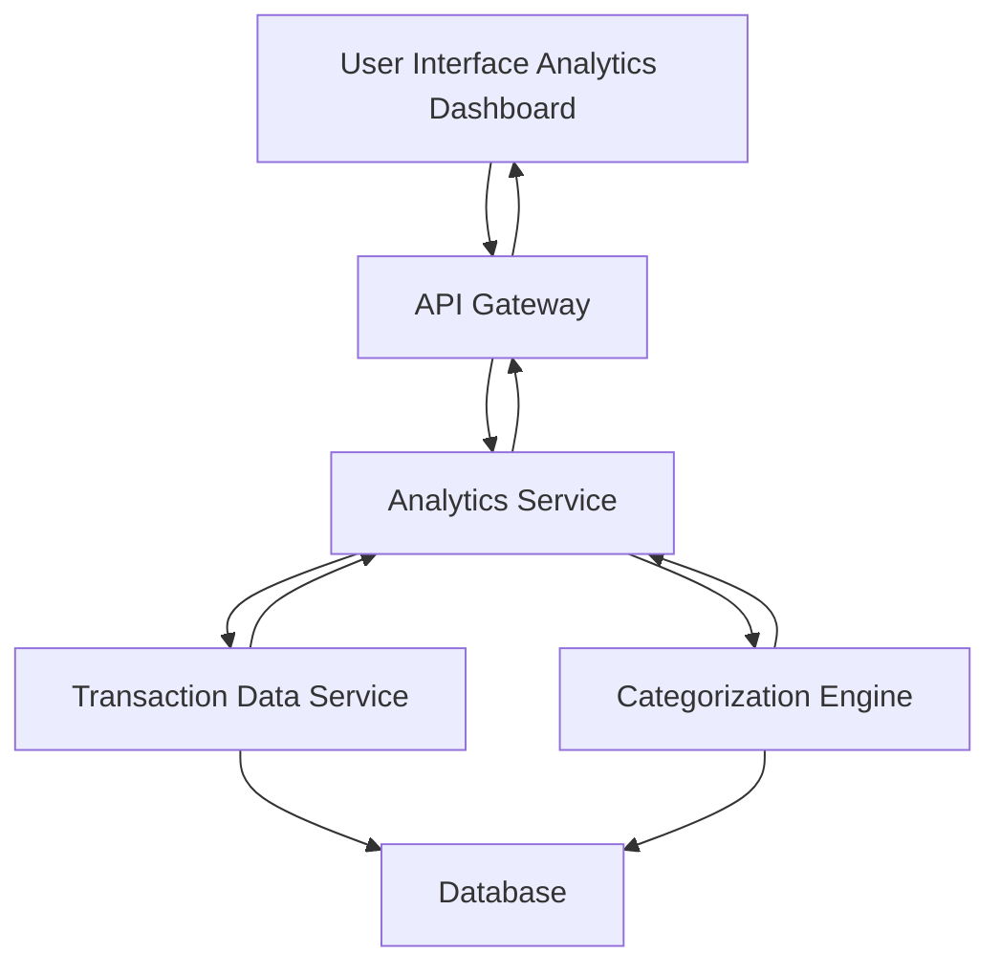

#### 1. High-Level Design

- **Summary:** This epic delivers interactive spending analytics and visualization capabilities that help users understand their spending patterns. The solution provides category-wise spending breakdowns across nine categories (Food & Dining, Fuel, Shopping, Travel, Entertainment, Utilities, Healthcare, Education, Miscellaneous), monthly spend trends, and interactive charts to enable data-driven financial decisions.

- **Component Flow:**

- **Integration Points:** 
  - Downstream: Transaction data service (for retrieving and categorizing transaction history across all credit cards)
  - No upstream systems explicitly mentioned in the epic

- **Key Assumptions:** 
  - Transaction categorization is automated using rule-based or ML-based classification; manual re-categorization by users is not in scope
  - Monthly trends display up to 12 months of historical data by default

- **NFR Highlights:** Analytics visualizations must load within acceptable time frames; System must handle transaction data aggregation and categorization efficiently

- **Data Flow:** User accesses the analytics dashboard through the UI, which sends requests via API Gateway to the Analytics Service. The service retrieves transaction history from the Transaction Data Service and applies categorization logic through the Categorization Engine, both accessing the Database. The system aggregates transactions into nine spending categories, calculates monthly trends, and generates visualization data. The processed analytics data is returned through the API Gateway and rendered as interactive charts and graphs in the user interface.

#### 2. Validation Report

- **Requirements Coverage:** The design comprehensively covers all scope elements including category-wise spending visualization (all nine categories specified), monthly spend trends, interactive charts and graphs, transaction categorization, and spending pattern analysis. The architecture supports efficient data aggregation and categorization as required by the NFRs, and properly integrates with the transaction data service dependency.