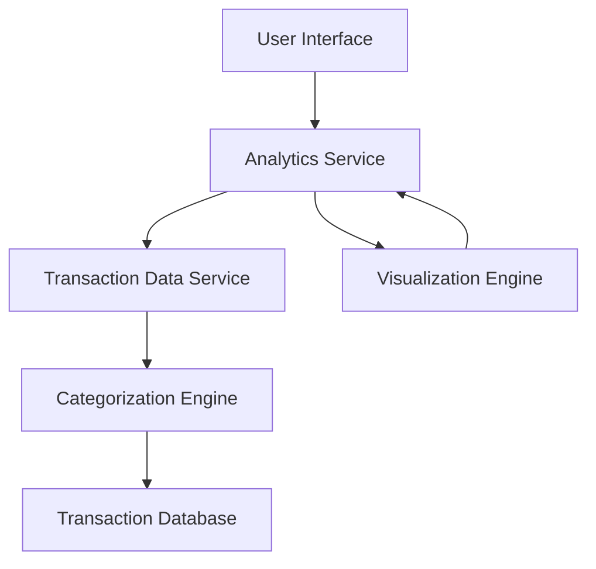

#### 1. High-Level Design

- **Summary:** This epic delivers interactive spending analytics capabilities enabling users to understand their spending patterns through category-wise breakdowns, monthly trends, and visual representations. The solution covers nine spending categories and provides data-driven insights for better financial decision-making.

- **Component Flow:**

- **Integration Points:** 
  - Upstream: Transaction Data Service (retrieves and categorizes transaction history across all credit cards)
  - Downstream: User Interface for interactive charts and visualizations

- **Key Assumptions:** 
  - Transaction categorization uses predefined rules or ML models to classify expenses into the nine categories
  - Historical transaction data is available for trend analysis over multiple months

- **NFR Highlights:** Analytics visualizations must load within acceptable time frames; System must handle transaction data aggregation and categorization efficiently

- **Data Flow:** User requests spending analytics → Analytics Service fetches transaction history from Transaction Data Service → Categorization Engine processes transactions and assigns them to categories (Food & Dining, Fuel, Shopping, Travel, Entertainment, Utilities, Healthcare, Education, Miscellaneous) → Aggregated data is computed for category-wise spending and monthly trends → Visualization Engine generates interactive charts and graphs → Analytics UI renders visualizations enabling users to explore spending patterns and identify insights

#### 2. Validation Report

- **Requirements Coverage:** The design comprehensively covers all scope requirements including category-wise spending visualization across all nine specified categories, monthly spend trends, interactive charts and graphs, transaction categorization, and spending pattern analysis. The architecture with dedicated categorization and visualization engines supports the NFRs for efficient data aggregation and acceptable visualization load times.