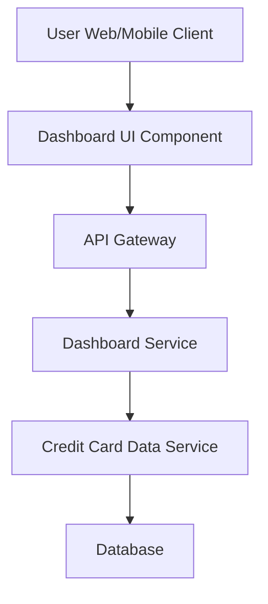

#### 1. High-Level Design

- **Summary:** This epic delivers a consolidated dashboard that displays key performance indicators (KPIs) for users' credit card portfolios, including monthly spend, total credit limit, available credit, and outstanding amount. The dashboard provides real-time monitoring of multiple credit cards from a single interface, enabling users to track their credit card financial health at a glance.

- **Component Flow:**

- **Integration Points:** 
  - **Upstream:** Credit card data service for retrieving card details, balances, credit limits, and outstanding amounts
  - **Downstream:** User interface (web, tablet, mobile) for rendering dashboard KPIs

- **Key Assumptions:** 
  - Credit card data is refreshed at regular intervals (e.g., every 15-30 minutes) to ensure near real-time accuracy
  - Authentication and authorization are handled by an existing identity service not explicitly mentioned in the epic

- **NFR Highlights:** Dashboard must load within 2 seconds; system must support responsive layouts across desktop, tablet, and mobile devices with modern and intuitive UI

- **Data Flow:** User authenticates and accesses the dashboard. The Dashboard UI Component requests KPI data via the API Gateway, which routes the request to the Dashboard Service. The Dashboard Service queries the Credit Card Data Service, which retrieves card details, balances, limits, and outstanding amounts from the Database. Aggregated KPI data (Monthly Spend, Total Credit Limit, Available Credit, Outstanding Amount) is returned through the chain and rendered on the user's device in a responsive layout.

#### 2. Validation Report

- **Requirements Coverage:** The design covers all stated scope items including dashboard KPIs display (Monthly Spend, Total Credit Limit, Available Credit, Outstanding Amount), multiple credit card view, consolidated interface, and real-time balance monitoring. The architecture supports the NFR requirements for 2-second load time and responsive design across devices. Integration with the credit card data service is properly identified. Out-of-scope items (Real Bank Integration, Card Payments, Fund Transfers, Loans, Payment Gateway Integration) are explicitly excluded and not included in the design.