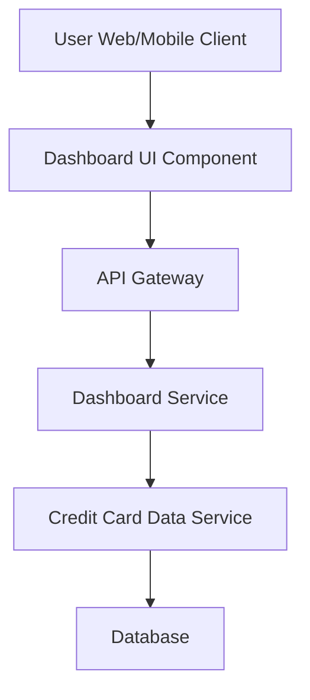

#### 1. High-Level Design

- **Summary:** This epic delivers a consolidated dashboard that displays key performance indicators (KPIs) for users' credit card portfolios, including monthly spend, total credit limit, available credit, and outstanding amounts. The dashboard provides real-time monitoring of multiple credit cards from a single, centralized interface.

- **Component Flow:**

- **Integration Points:** 
  - **Upstream:** Credit card data service (provides card details, balances, limits, and real-time updates)
  - **Downstream:** User interface clients (web, tablet, mobile)

- **Key Assumptions:** 
  - Credit card data service provides a REST/GraphQL API with real-time or near real-time data updates
  - KPI calculations (monthly spend, available credit) are pre-computed by the credit card data service or cached for performance

- **NFR Highlights:** Dashboard must load within 2 seconds; must support responsive layouts across desktop, tablet, and mobile devices; UI must be modern and intuitive

- **Data Flow:** User requests dashboard → API Gateway authenticates and routes request → Dashboard Service retrieves aggregated KPI data from Credit Card Data Service → Credit Card Data Service queries Database for card details, balances, limits, and monthly spend → Data is returned through the service layers → Dashboard UI Component renders KPIs (Monthly Spend, Total Credit Limit, Available Credit, Outstanding Amount) in a responsive layout within 2 seconds

#### 2. Validation Report

- **Requirements Coverage:** The design fully covers the epic's stated scope including dashboard KPIs display, multiple credit card view, consolidated interface, and real-time balance monitoring. The component architecture supports the 2-second load time NFR through service-oriented design and assumes pre-computed aggregations. The responsive UI requirement is addressed through the UI component layer supporting multiple device types.