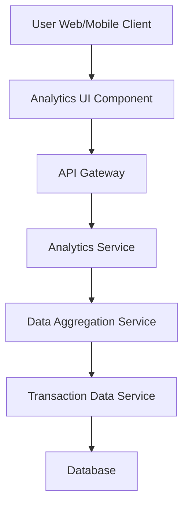

#### 1. High-Level Design

- **Summary:** This epic provides interactive visualizations and analytics to help users understand their spending behavior across different categories (Food & Dining, Fuel, Shopping, Travel, Entertainment, Utilities, Healthcare, Education, Miscellaneous). Users can analyze category-wise spending patterns, monthly trends, and card-wise spending to support better financial planning and budget management.

- **Component Flow:**

- **Integration Points:**
  - **Upstream:** Transaction data service for category-tagged spending information
  - **Upstream:** Data aggregation service for computing category totals and trends
  - **Downstream:** Interactive charting/visualization library on the user interface for rendering graphs across all devices

- **Key Assumptions:**
  - Transactions are pre-categorized by the transaction data service or a categorization engine
  - Aggregation computations are performed server-side to optimize client performance and support the 3-second rendering requirement

- **NFR Highlights:** Analytics visualizations must render within 3 seconds; system must handle data aggregation for multiple categories efficiently; charts must be interactive and responsive across all devices

- **Data Flow:** User navigates to the analytics section. The Analytics UI Component requests spending data via the API Gateway to the Analytics Service. The Analytics Service calls the Data Aggregation Service, which retrieves category-tagged transaction data from the Transaction Data Service and Database. The aggregation service computes category totals, monthly trends, and card-wise breakdowns. The aggregated data is returned to the Analytics Service, then to the UI, where interactive charts and graphs are rendered within 3 seconds, displaying spending patterns across categories.

#### 2. Validation Report

- **Requirements Coverage:** The design fully addresses the epic's scope including category-wise spending visualization, interactive charts and graphs, spending pattern analysis, monthly spend trends, and card-wise spend analysis. The architecture supports the NFR requirements for 3-second rendering time, efficient data aggregation for multiple categories, and interactive/responsive charts across all devices. Dependencies on transaction data service and data aggregation service are properly identified and integrated. Out-of-scope items (Real Bank Integration, Predictive analytics, Budget setting features, Spending alerts) are explicitly excluded from the design.