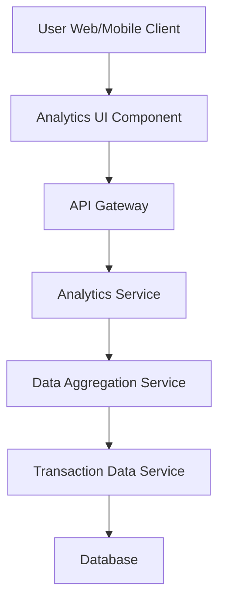

#### 1. High-Level Design

- **Summary:** This epic provides interactive visualizations and analytics to help users understand spending behavior across nine predefined categories (Food & Dining, Fuel, Shopping, Travel, Entertainment, Utilities, Healthcare, Education, Miscellaneous). Users can analyze spending patterns, view monthly trends, and perform card-wise spend analysis for better financial planning.

- **Component Flow:**

- **Integration Points:**
  - **Upstream:** Transaction data service (provides category-tagged spending information), Data aggregation service (computes category totals and trends)
  - **Downstream:** User interface clients with interactive charting libraries (web, tablet, mobile)

- **Key Assumptions:**
  - Transactions are pre-categorized at ingestion time or by the transaction data service
  - Data aggregation service maintains materialized views or cached aggregates for monthly and category-wise totals to meet the 3-second rendering requirement

- **NFR Highlights:** Analytics visualizations must render within 3 seconds; system must handle data aggregation for multiple categories efficiently; charts must be interactive and responsive across all devices

- **Data Flow:** User requests analytics view → API Gateway authenticates and routes request → Analytics Service calls Data Aggregation Service with filters (date range, card, category) → Data Aggregation Service retrieves pre-categorized transaction data from Transaction Data Service → Transaction Data Service queries Database for category-tagged transactions → Aggregated spending totals by category, monthly trends, and card-wise breakdowns are computed → Data is formatted for visualization and returned → Analytics UI Component renders interactive charts and graphs within 3 seconds

#### 2. Validation Report

- **Requirements Coverage:** The design comprehensively covers the epic's scope including category-wise spending visualization, interactive charts, spending pattern analysis, monthly trends, and card-wise analysis. The multi-layer architecture with dedicated data aggregation service supports efficient handling of multiple categories and the 3-second rendering NFR. Interactive and responsive chart requirements are addressed through the Analytics UI Component supporting all device types.