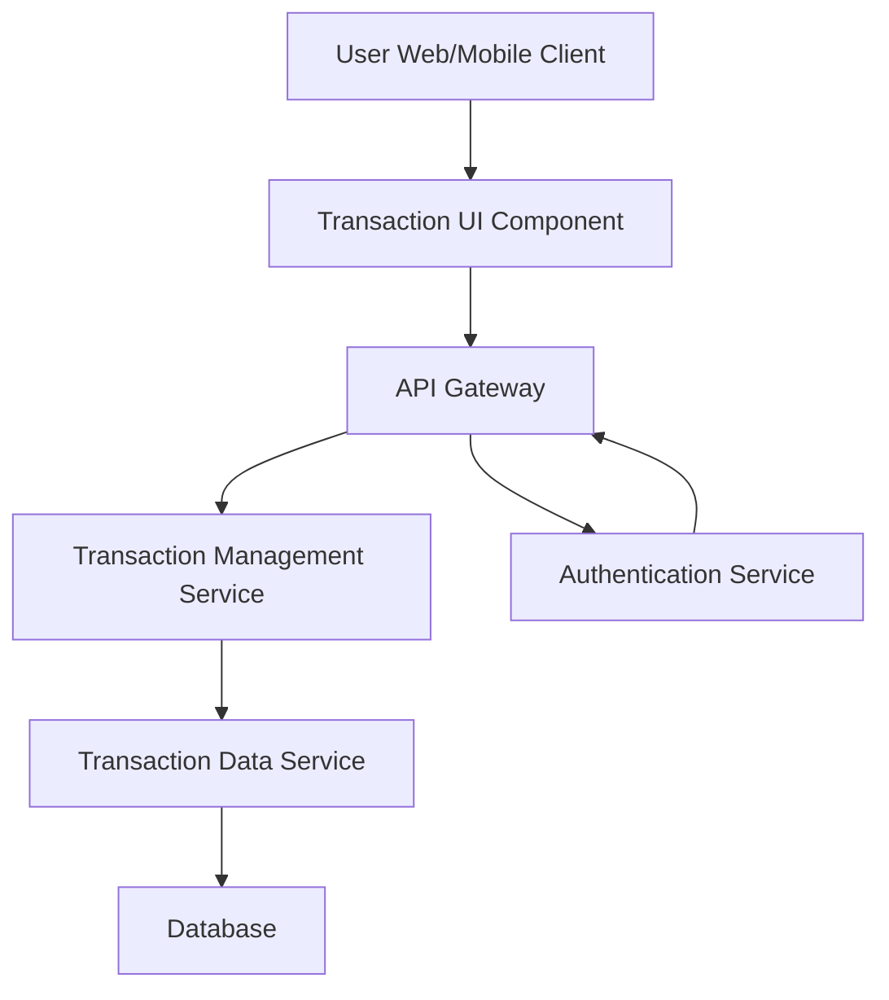

#### 1. High-Level Design

- **Summary:** This epic enables users to view and manage credit card transactions across all their cards. Users can access detailed transaction history with pagination support, view individual transaction details, and monitor spending activities in real-time or near real-time, providing complete transparency and traceability.

- **Component Flow:**

- **Integration Points:**
  - **Upstream:** Transaction data service (retrieves transaction records), Authentication service (provides secure access to sensitive transaction data)
  - **Downstream:** User interface clients (web, tablet, mobile)

- **Key Assumptions:**
  - Transaction data service supports cursor-based or offset pagination for efficient retrieval of large datasets
  - Real-time or near real-time transaction display assumes event-driven updates or polling mechanism with acceptable latency (e.g., within 1-5 minutes)

- **NFR Highlights:** Transaction list must support pagination for large datasets; system must display transactions in real-time or near real-time; transaction data must be secure and encrypted

- **Data Flow:** User requests transaction list → API Gateway authenticates via Authentication Service → Transaction Management Service retrieves paginated transaction records from Transaction Data Service with filters (card, date range, page) → Transaction Data Service queries Database with pagination parameters → Encrypted transaction data is returned → Transaction UI Component displays transaction listing with pagination controls → User selects transaction for details → Detailed transaction view is rendered with secure, encrypted data transmission throughout

#### 2. Validation Report

- **Requirements Coverage:** The design fully addresses the epic's scope including transaction listing, transaction details view, multi-card transaction support, and transaction history access. The architecture explicitly incorporates the Authentication Service to meet the security NFR for sensitive transaction data. Pagination support for large datasets is addressed through the Transaction Management Service and Transaction Data Service design. The real-time/near real-time display requirement is supported by the service architecture, though the specific update mechanism (push vs. poll) is assumed based on typical patterns.