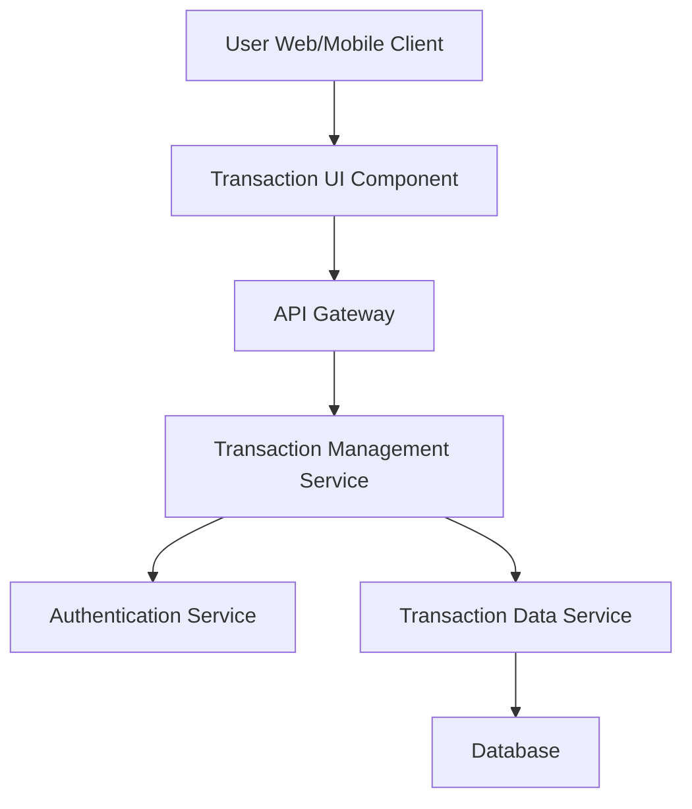

#### 1. High-Level Design

- **Summary:** This epic enables users to view and manage their credit card transactions across all their cards. Users can access detailed transaction history, view individual transaction details, and monitor spending activities, providing complete transparency and traceability of all credit card usage.

- **Component Flow:**

- **Integration Points:**
  - **Upstream:** Transaction data service for retrieving transaction records
  - **Upstream:** Authentication service for secure access to sensitive transaction data
  - **Downstream:** User interface for displaying transaction lists and detail views with pagination support

- **Key Assumptions:**
  - Transaction data is stored in a structured format with standard fields (date, amount, merchant, category, card, status)
  - Pagination is implemented server-side with configurable page sizes to handle large transaction datasets efficiently

- **NFR Highlights:** Transaction list must support pagination for large datasets; system must display transactions in real-time or near real-time; transaction data must be secure and encrypted

- **Data Flow:** User authenticates via the Authentication Service and requests transaction history. The Transaction UI Component sends a request through the API Gateway to the Transaction Management Service. The service validates user permissions via the Authentication Service, then queries the Transaction Data Service with pagination parameters. The Transaction Data Service retrieves encrypted transaction records from the Database. Transaction data is decrypted, paginated, and returned through the chain to the UI, where users can view transaction lists, access detailed transaction information, and navigate through pages for large datasets. All transaction data is transmitted securely using encryption.

#### 2. Validation Report

- **Requirements Coverage:** The design comprehensively covers all scope items including transaction listing, transaction details view, multi-card transaction support, and transaction history access. The architecture addresses all NFR requirements: pagination support for large datasets, real-time or near real-time transaction display, and secure/encrypted transaction data. Dependencies on transaction data service and authentication service are properly integrated into the design. Out-of-scope items (Real Bank Integration, Transaction disputes, Transaction categorization editing, Receipt uploads, Transaction export functionality) are explicitly excluded and not part of the design.