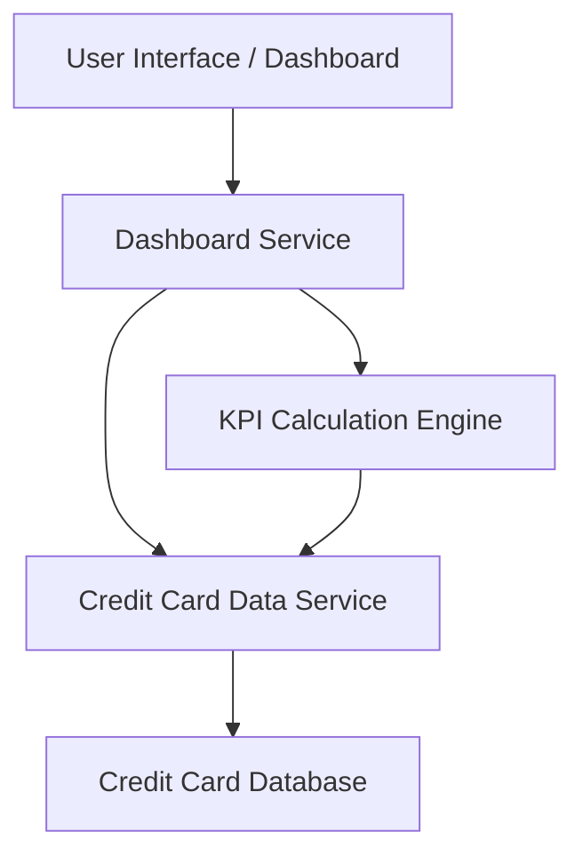

#### 1. High-Level Design

- **Summary:** This epic delivers a consolidated dashboard interface that displays key performance indicators (KPIs) for users' credit card portfolios. Users can view monthly spend, total credit limit, available credit, and outstanding amounts across multiple credit cards from a single unified interface, providing comprehensive financial health visibility.

- **Component Flow:**

- **Integration Points:** 
  - Upstream: Credit card data source (provides card details, balances, credit limits, and outstanding amounts)
  - Downstream: User interface/frontend application (consumes aggregated KPI data)

- **Key Assumptions:** 
  - Credit card data is available via API or service endpoint with sufficient detail (balances, limits, spend data)
  - KPI calculations are performed server-side and cached for near real-time performance

- **NFR Highlights:** Dashboard must be responsive across devices; KPI calculations must be real-time or near real-time; System must support viewing multiple credit cards simultaneously

- **Data Flow:** User accesses the dashboard UI, which requests KPI data from the Dashboard Service. The Dashboard Service retrieves credit card details (balances, limits, outstanding amounts) from the Credit Card Data Service, which queries the Credit Card Database. The KPI Calculation Engine aggregates monthly spend, total credit limit, available credit, and outstanding amount across all cards. Calculated KPIs are returned to the Dashboard Service and rendered in the UI for user visibility.

#### 2. Validation Report

- **Requirements Coverage:** The design fully covers the epic's stated scope including dashboard KPIs display, monthly spend tracking, credit limit aggregation, available credit calculation, outstanding amount display, and multiple credit card view. The architecture supports responsive UI, near real-time calculations, and multi-card aggregation as specified in the NFRs. Integration with the credit card data source is clearly defined, and out-of-scope items (real bank integration, payments, transfers, loans) are appropriately excluded.