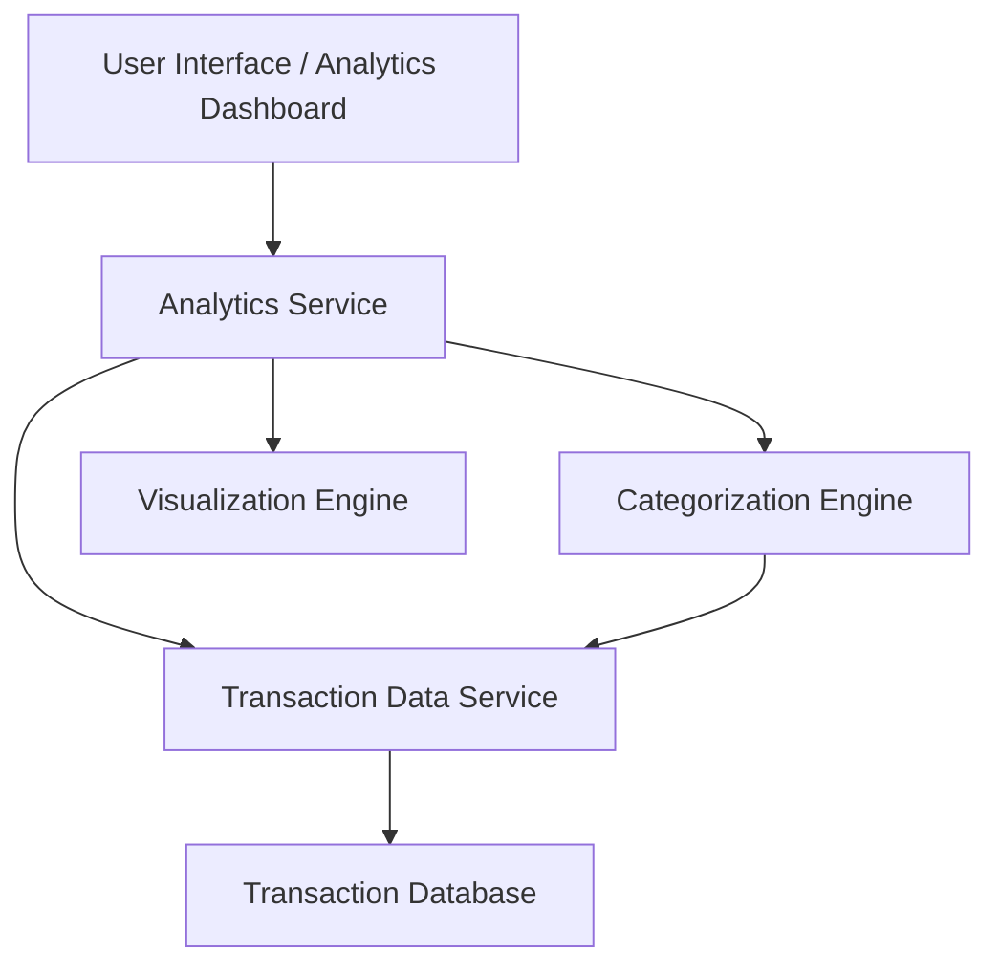

#### 1. High-Level Design

- **Summary:** This epic provides interactive visualizations and analytics capabilities that enable users to analyze spending patterns through category-wise spending analysis and monthly spend trends. Users can view spending across 9 predefined categories (Food & Dining, Fuel, Shopping, Travel, Entertainment, Utilities, Healthcare, Education, Miscellaneous) with card-wise breakdowns to identify behaviors and trends over time.

- **Component Flow:**

- **Integration Points:** 
  - Upstream: Transaction data service (provides spending records and transaction details)
  - Upstream: Categorization engine or service (classifies transactions into predefined categories)
  - Downstream: User interface/frontend (renders interactive charts and graphs)

- **Key Assumptions:** 
  - Transactions are pre-categorized or categorization service can classify transactions into the 9 predefined categories in near real-time
  - Historical transaction data is available for trend analysis with sufficient retention period (e.g., 12-24 months)

- **NFR Highlights:** Visualizations must be interactive and responsive; Analytics must support historical data analysis; Charts must render efficiently for large transaction datasets

- **Data Flow:** User accesses the analytics dashboard UI and selects analysis parameters (date range, card, category). The Analytics Service retrieves transaction records from the Transaction Data Service, which queries the Transaction Database. The Categorization Engine classifies transactions into the 9 predefined categories. The Analytics Service aggregates spending by category, month, and card. The Visualization Engine generates interactive charts (category-wise spending, monthly trends, card-wise breakdowns) and returns them to the UI for display.

#### 2. Validation Report

- **Requirements Coverage:** The design fully addresses the epic's scope including category-wise spending visualization, monthly spend trends analysis, card-wise spend analysis, interactive charts, and spending pattern identification across the 9 predefined categories. The architecture supports interactive and responsive visualizations, historical data analysis, and efficient rendering for large datasets as specified in the NFRs. Dependencies on transaction data service and categorization engine are clearly defined, and out-of-scope items (real bank integration, payments, transfers, loans, real-time alerts) are appropriately excluded.