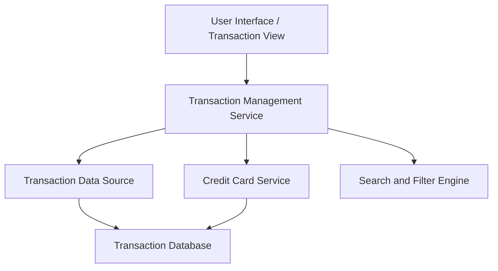

#### 1. High-Level Design

- **Summary:** This epic enables users to view and manage credit card transactions across all cards. Users can access detailed transaction information, review transaction history, and monitor spending activities at the transaction level, providing granular data visibility that supports dashboard and analytics capabilities with transaction filtering and search.

- **Component Flow:**

- **Integration Points:** 
  - Upstream: Transaction data source (provides transaction records and details)
  - Upstream: Credit card service (provides card-transaction mapping and card details)
  - Downstream: User interface/frontend (displays transaction lists and detail views)

- **Key Assumptions:** 
  - Transaction data includes sufficient detail fields (merchant, amount, date, category, card ID) for filtering and search
  - Pagination is implemented server-side with configurable page size to handle large transaction datasets

- **NFR Highlights:** Transaction list must support pagination for large datasets; Transaction retrieval must be performant with sub-second response times; System must handle concurrent transaction queries from multiple users

- **Data Flow:** User accesses the transaction view UI and can filter/search transactions by various criteria (date range, card, merchant, amount, category). The Transaction Management Service receives the request and queries the Transaction Data Source for matching transactions from the Transaction Database. The Credit Card Service provides card-transaction mapping to aggregate transactions across multiple cards. The Search and Filter Engine applies user-specified criteria and implements pagination. Transaction results (list or detail view) are returned to the Transaction Management Service and rendered in the UI with pagination controls for large datasets.

#### 2. Validation Report

- **Requirements Coverage:** The design fully covers the epic's stated scope including transaction list display, transaction detail view, multi-card transaction aggregation, transaction history access, and transaction filtering and search capabilities. The architecture supports pagination for large datasets, sub-second response times, and concurrent queries as specified in the NFRs. Dependencies on transaction data source and credit card service are clearly defined, and out-of-scope items (real bank integration, payments, transfers, loans, payment gateway, disputes/chargebacks) are appropriately excluded.