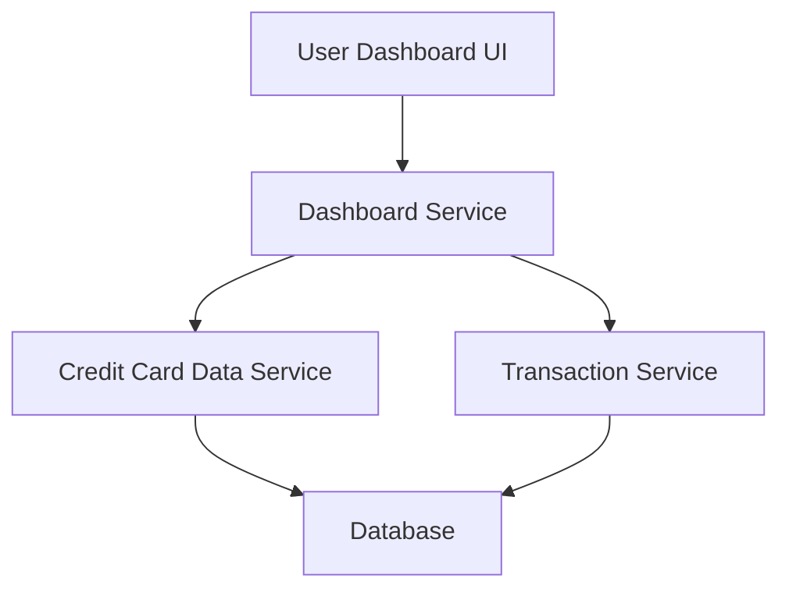

#### 1. High-Level Design

- **Summary**: This epic delivers a consolidated dashboard that displays key performance indicators (KPIs) for a user's credit card portfolio, including monthly spend, total credit limit, available credit, and outstanding amount across multiple credit cards. The dashboard provides a responsive, modern interface for instant visibility into credit card financial health.

- **Component Flow**:

- **Integration Points**: 
  - Upstream: Credit Card Data Service (for card details and balances)
  - Upstream: Transaction Service (for monthly spend and outstanding amounts)
  - Downstream: User Dashboard UI (web/mobile responsive interface)

- **Key Assumptions**: 
  - Credit Card Data Service and Transaction Service expose REST APIs with sub-200ms response times for aggregated data.
  - KPI calculations (available credit, outstanding amount) are computed server-side and cached for performance.

- **NFR Highlights**: Dashboard must load within 2 seconds; responsive design across desktop, tablet, and mobile; real-time or near real-time data refresh.

- **Data Flow**: User requests dashboard → Dashboard Service aggregates data from Credit Card Data Service (card details, limits, balances) and Transaction Service (monthly spend, outstanding amounts) → Services query Database → Aggregated KPIs returned to Dashboard Service → Dashboard UI renders KPIs with responsive layout.

#### 2. Validation Report

- **Requirements Coverage**: The design fully covers the epic's stated scope including all KPIs (monthly spend, total credit limit, available credit, outstanding amount), multiple card support, and responsive layout. NFRs for 2-second load time and responsive design are addressed through service-level aggregation and caching strategies. Dependencies on Credit Card Data Service and Transaction Service are explicitly mapped in the component flow.