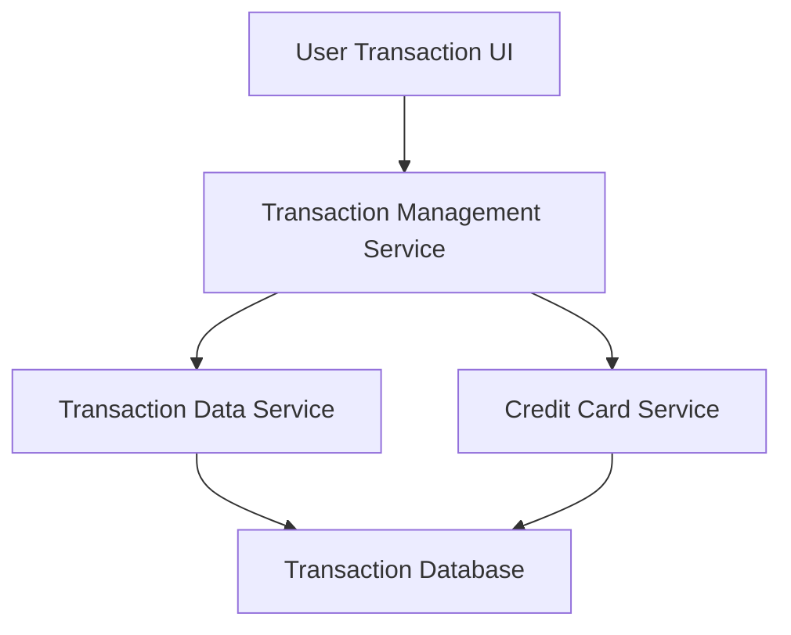

#### 1. High-Level Design

- **Summary**: This epic enables users to view, track, and filter credit card transactions across multiple cards. Users can access detailed transaction history with filtering capabilities to monitor spending, verify charges, and maintain financial awareness. The system supports efficient handling of large transaction volumes.

- **Component Flow**:

- **Integration Points**: 
  - Upstream: Transaction Data Service (for retrieving transaction records)
  - Upstream: Credit Card Service (for associating transactions with specific cards)
  - Downstream: User Transaction UI (transaction listing and details view)

- **Key Assumptions**: 
  - Transaction Data Service provides paginated API responses to handle up to 10,000 transactions per user efficiently.
  - Filtering is performed server-side with indexed database queries to meet the 300ms latency requirement.

- **NFR Highlights**: System must handle 10,000 transactions per user; transaction retrieval API latency under 300ms; secure data storage and transmission (encryption in transit and at rest).

- **Data Flow**: User requests transaction list with optional filters → Transaction Management Service queries Transaction Data Service with pagination and filter parameters → Service joins with Credit Card Service to associate transactions with cards → Transaction Database returns filtered, paginated results → Transaction UI displays list with details view capability.

#### 2. Validation Report

- **Requirements Coverage**: The design covers all stated requirements including transaction listing, details view, multi-card aggregation, history access, and filtering capabilities. NFRs for handling 10,000 transactions and 300ms API latency are addressed through pagination and database indexing. Security requirements for data storage and transmission are noted. Dependencies on Transaction Data Service and Credit Card Service are explicitly mapped.