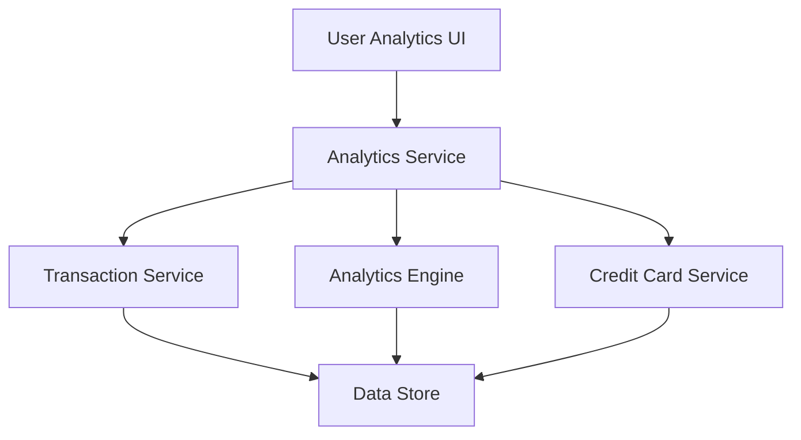

#### 1. High-Level Design

- **Summary**: This epic delivers interactive analytics and visualizations to help users understand spending patterns through category-wise analysis (9 predefined categories), monthly spend trends, and card-wise spend comparison. The system provides actionable insights for financial decision-making through interactive charts and graphs.

- **Component Flow**:

- **Integration Points**: 
  - Upstream: Transaction Service (for raw transaction data)
  - Upstream: Analytics Engine (for aggregating and processing spending data by category and time period)
  - Upstream: Credit Card Service (for card-specific analysis)
  - Downstream: User Analytics UI (interactive charts, graphs, and visualizations)

- **Key Assumptions**: 
  - Transaction data includes category tags (Food & Dining, Fuel, Shopping, Travel, Entertainment, Utilities, Healthcare, Education, Miscellaneous) for categorization.
  - Analytics Engine pre-aggregates data periodically (e.g., hourly/daily) to meet the 3-second rendering requirement for visualizations.

- **NFR Highlights**: Analytics visualizations must render within 3 seconds; interactive filtering and drill-down capabilities; responsive and accessible charts across all device types.

- **Data Flow**: User requests analytics view → Analytics Service retrieves raw transaction data from Transaction Service → Analytics Engine aggregates data by category, time period, and card → Credit Card Service provides card metadata → Aggregated analytics data returned to Analytics Service → Analytics UI renders interactive charts with filtering and drill-down capabilities.

#### 2. Validation Report

- **Requirements Coverage**: The design fully addresses the epic's scope including category-wise spending (9 categories), monthly trends, card-wise analysis, interactive charts, and pattern identification. NFRs for 3-second rendering, interactive filtering, and responsive design are supported through pre-aggregation in the Analytics Engine and client-side chart libraries. Dependencies on Transaction Service, Analytics Engine, and Credit Card Service are explicitly mapped. Out-of-scope items (real bank integration, predictive analytics, budget recommendations) are acknowledged and excluded.