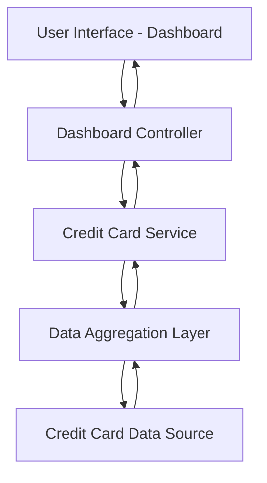

#### 1. High-Level Design

- **Summary**: This epic delivers a consolidated dashboard that displays key performance indicators (KPIs) for all user credit cards, including monthly spend, total credit limit, available credit, and outstanding amounts. The dashboard provides a centralized view enabling users to assess their financial position and credit utilization across multiple cards.

- **Component Flow**:

- **Integration Points**: 
  - Upstream: Credit card data source or mock data service for card details, transaction history, and balance information
  - Downstream: Dashboard UI components for rendering KPIs and card overview

- **Key Assumptions**: 
  - Data is aggregated server-side before being sent to the dashboard UI
  - Credit card data is available in a structured format with consistent field naming for limits, balances, and transactions

- **NFR Highlights**: Dashboard must load within 2 seconds; System must support responsive layouts for desktop, tablet, and mobile devices; Data refresh rate must be near real-time or clearly indicated

- **Data Flow**: User requests dashboard → Dashboard Controller fetches data from Credit Card Service → Service queries Data Aggregation Layer which retrieves raw card data from Credit Card Data Source → Aggregation Layer calculates KPIs (monthly spend, total credit limit, available credit, outstanding amounts) → Processed data flows back through Service to Controller → Dashboard UI renders KPIs and multi-card overview with responsive layout

#### 2. Validation Report

- **Requirements Coverage**: The design covers all stated requirements including dashboard KPIs display, monthly spend tracking, credit limit aggregation, available credit calculation, outstanding amount visibility, multiple credit card view, and responsive dashboard layout. The architecture supports the 2-second load time NFR through a dedicated aggregation layer and aligns with the scope of providing centralized financial visibility without real bank integration.