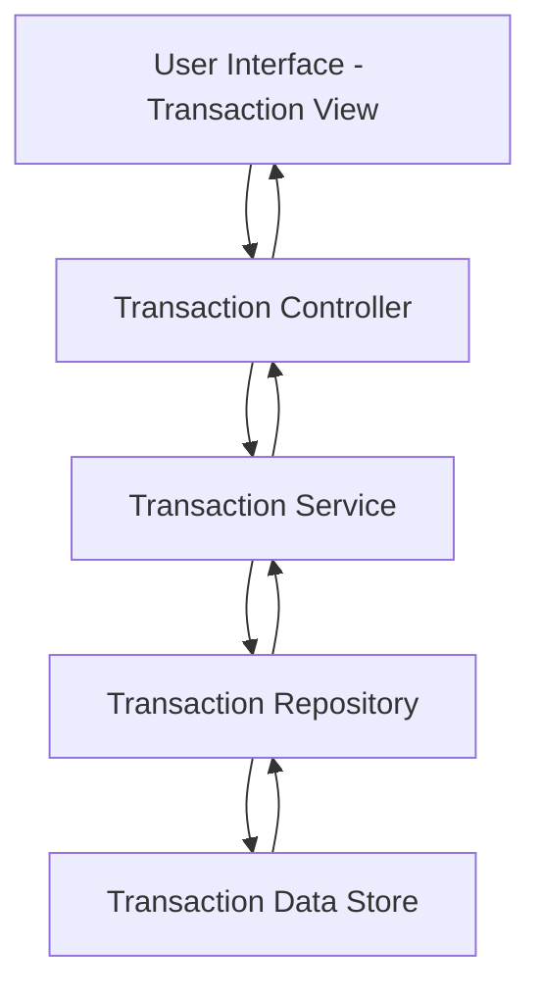

#### 1. High-Level Design

- **Summary**: This epic provides comprehensive transaction viewing and monitoring capabilities across multiple credit cards. Users can access detailed transaction histories with filtering and organization features to track spending activities, verify charges, and maintain financial awareness.

- **Component Flow**:

- **Integration Points**: 
  - Upstream: Transaction data service or repository for retrieving historical and current transaction records across all linked credit cards
  - Downstream: Transaction UI components for listing, filtering, and detail views

- **Key Assumptions**: 
  - Transactions are pre-stored and indexed for efficient retrieval and filtering
  - Pagination or infinite scroll is implemented at the service layer to handle large datasets

- **NFR Highlights**: Transaction list must support pagination or infinite scroll for performance; System must handle display of large transaction volumes efficiently; Interface must be responsive across all device types

- **Data Flow**: User accesses transaction view → Transaction Controller requests data from Transaction Service with pagination parameters → Service queries Transaction Repository which retrieves transaction records from Transaction Data Store → Repository returns paginated results aggregated across multiple cards → Service formats transaction details → Controller delivers data to UI → Transaction View renders list with filtering options and detail views for individual transactions

#### 2. Validation Report

- **Requirements Coverage**: The design addresses all requirements including transaction listing, transaction details view, multi-card transaction aggregation, transaction history access, and responsive transaction interface. The architecture supports efficient handling of large transaction volumes through pagination/infinite scroll as specified in the NFRs, and provides the foundation for filtering and organization capabilities within scope.