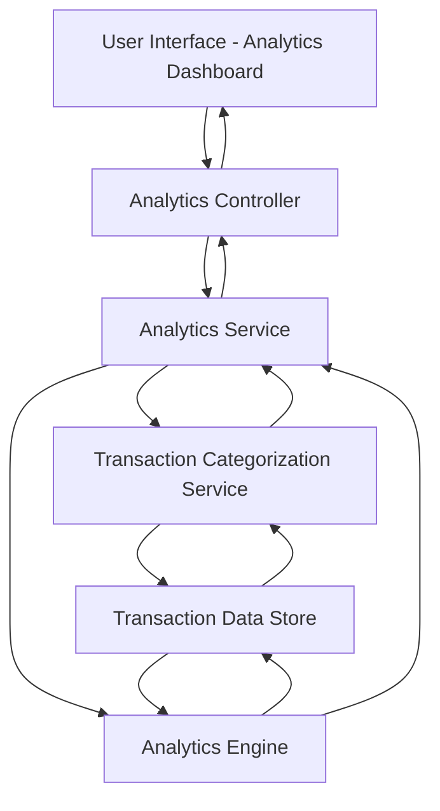

#### 1. High-Level Design

- **Summary**: This epic delivers interactive visualizations and analytical capabilities for understanding spending patterns across categories and time periods. Users can analyze monthly spend trends, view card-wise breakdowns, and explore category-wise spending across nine predefined categories (Food & Dining, Fuel, Shopping, Travel, Entertainment, Utilities, Healthcare, Education, Miscellaneous).

- **Component Flow**:

- **Integration Points**: 
  - Upstream: Transaction categorization service for classifying transactions into predefined spending categories; Analytics engine or charting library for visualization rendering
  - Downstream: Interactive charting components in the UI for rendering visualizations

- **Key Assumptions**: 
  - Transaction categorization logic is already implemented or uses rule-based/ML classification to map transactions to the nine predefined categories
  - Analytics aggregations are computed on-demand or pre-computed for common time periods to meet the 3-second rendering requirement

- **NFR Highlights**: Visualizations must render within 3 seconds; Charts must be interactive and responsive; System must support data aggregation across multiple time periods efficiently

- **Data Flow**: User accesses analytics dashboard → Analytics Controller requests insights from Analytics Service → Service calls Transaction Categorization Service to classify transactions into nine categories → Service invokes Analytics Engine to aggregate data by time period, card, and category → Both services query Transaction Data Store for raw transaction data → Aggregated results (monthly trends, card-wise breakdowns, category distributions) flow back to Analytics Service → Controller delivers formatted data to UI → Analytics Dashboard renders interactive charts and graphs with responsive design

#### 2. Validation Report

- **Requirements Coverage**: The design comprehensively covers all requirements including monthly spend trend visualization, card-wise spend analysis, category-wise spending breakdown, interactive charts and graphs, nine spending categories support, and responsive analytics interface. The architecture supports the 3-second rendering NFR through efficient data aggregation and leverages dedicated categorization and analytics services as specified in the dependencies.