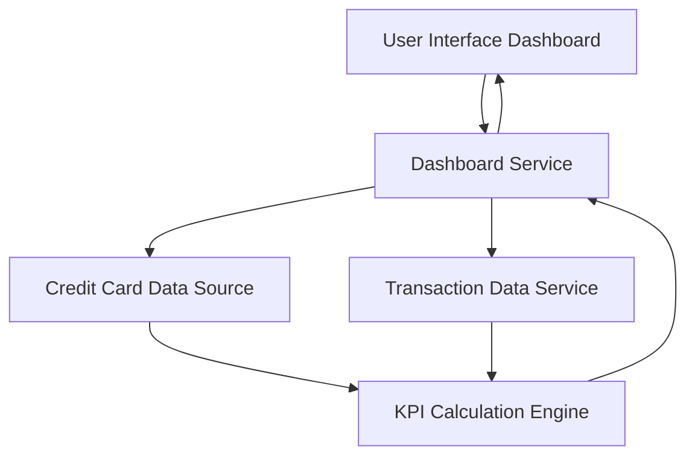

#### 1. High-Level Design

- **Summary:** This epic delivers a consolidated credit card dashboard that displays key performance indicators (KPIs) including monthly spend, total credit limit, available credit, and outstanding amounts across all user credit cards. The dashboard provides real-time visibility into credit card financial health through a modern, responsive interface accessible across desktop, tablet, and mobile devices.

- **Component Flow:**

- **Integration Points:** 
  - Upstream: Credit card data source (for card balances, limits, and transaction data)
  - Downstream: Dashboard service provides aggregated KPI data to the user interface layer

- **Key Assumptions:** 
  - Credit card data source provides real-time or near-real-time data updates for accurate KPI calculations
  - KPI metrics are calculated server-side and cached appropriately to meet performance requirements

- **NFR Highlights:** Dashboard must be responsive across desktop, tablet, and mobile devices; Page load time must support real-time data refresh for KPI metrics

- **Data Flow:** User accesses the dashboard through the UI, which requests KPI data from the Dashboard Service. The Dashboard Service retrieves card balances and limits from the Credit Card Data Source and transaction data from the Transaction Data Service. The KPI Calculation Engine aggregates this data to compute monthly spend, total credit limit, available credit, and outstanding amounts. The calculated KPIs are returned to the Dashboard Service, which sends them to the UI for display.

#### 2. Validation Report

- **Requirements Coverage:** The design fully covers the epic's stated scope including dashboard KPIs display, monthly spend tracking, total credit limit visualization, available credit calculation, outstanding amount tracking, and responsive layout design. All integration dependencies with credit card data source are addressed, and the architecture supports the specified NFRs for responsiveness and real-time data refresh.