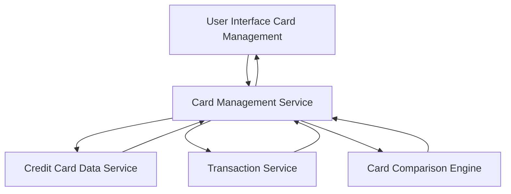

#### 1. High-Level Design

- **Summary:** This epic enables users to manage and view multiple credit cards (up to 10 per user) within a single consolidated interface. Users can track and compare different cards, viewing their respective limits, balances, and usage patterns. The feature provides card-wise spend analysis and card comparison capabilities to simplify multi-card management.

- **Component Flow:**

- **Integration Points:**
  - Upstream: Credit card data service (for fetching card details and balances), Transaction service (for card-wise spending data)
  - Downstream: Card Management Service provides consolidated card views and comparison data to the user interface

- **Key Assumptions:**
  - Card data is retrieved in batch for performance optimization when displaying multiple cards
  - Card comparison logic is implemented server-side to support consistent business rules

- **NFR Highlights:** System must support viewing and managing at least 10 credit cards per user; Card data retrieval must be optimized for performance

- **Data Flow:** User accesses the card management interface, which requests consolidated card data from the Card Management Service. The service retrieves card details and balances from the Credit Card Data Service and card-wise spending data from the Transaction Service. The Card Comparison Engine processes this data to enable comparison capabilities. The aggregated and processed card information is returned to the UI, displaying all cards in a consolidated view with their respective limits, balances, and usage patterns.

#### 2. Validation Report

- **Requirements Coverage:** The design comprehensively covers the epic's scope including multiple credit card display, card-wise spend analysis, card information management, card comparison capabilities, and consolidated card view. The architecture addresses the NFR requirement to support at least 10 cards per user with optimized data retrieval. All dependencies on credit card data service and transaction service are properly integrated.