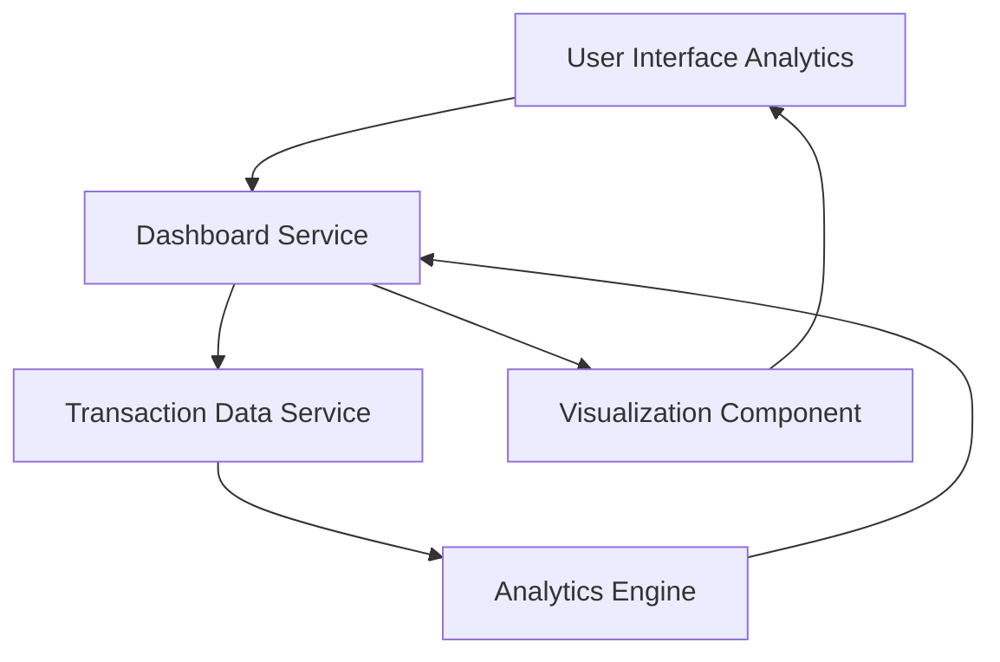

#### 1. High-Level Design

- **Summary:** This epic delivers interactive visualizations and analytics capabilities for users to understand spending patterns across 9 categories (Food & Dining, Fuel, Shopping, Travel, Entertainment, Utilities, Healthcare, Education, Miscellaneous). The feature includes monthly spend trends, category-wise spending breakdowns, and interactive charts to enable data-driven financial decisions and identify potential savings opportunities.

- **Component Flow:**

- **Integration Points:**
  - Upstream: Transaction data service (for categorized spending information), Dashboard service (for trend calculations and aggregations)
  - Downstream: Visualization Component renders interactive charts and graphs for the user interface

- **Key Assumptions:**
  - Transaction data is pre-categorized by the transaction data service into the 9 defined spending categories
  - Monthly trend calculations are performed with aggregations cached for performance optimization

- **NFR Highlights:** Analytics visualizations must load within acceptable performance thresholds; Charts must be interactive and responsive across all device types

- **Data Flow:** User accesses the spending analytics interface, which requests analytics data from the Dashboard Service. The service retrieves categorized transaction data from the Transaction Data Service and passes it to the Analytics Engine for trend calculations and aggregations. The Analytics Engine processes spending patterns across the 9 categories and calculates monthly trends. The processed analytics data is sent to the Visualization Component, which generates interactive charts and graphs. The visualizations are rendered in the UI, allowing users to explore spending patterns, identify trends, and make data-driven financial decisions.

#### 2. Validation Report

- **Requirements Coverage:** The design fully addresses the epic's scope including category-wise spending visualization, monthly spend trends analysis, interactive charts and graphs, spending pattern identification, and multi-category tracking across all 9 spending categories. The architecture supports the NFRs for performance thresholds and responsive interactive charts across all device types. All dependencies on transaction data service and dashboard service for trend calculations are properly integrated.