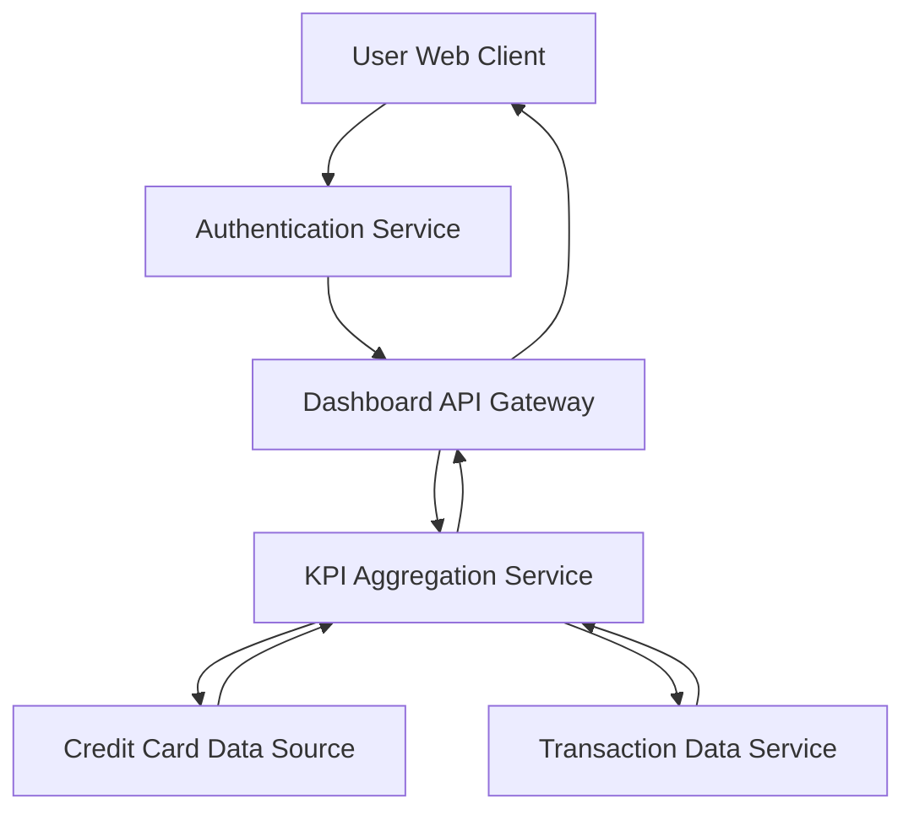

#### 1. High-Level Design

- **Summary:** This epic delivers a consolidated dashboard that displays key performance indicators (KPIs) for all user credit cards, including monthly spend, total credit limit, available credit, and outstanding amounts. The dashboard provides a single-pane view for monitoring multiple credit cards simultaneously.

- **Component Flow:**

- **Integration Points:** 
  - Upstream: User authentication service for user identity verification
  - Upstream: Credit Card data source for card details (limits, balances)
  - Upstream: Transaction data aggregation service for spend calculations
  - Downstream: Web/mobile client for dashboard rendering

- **Key Assumptions:** 
  - Credit card data is refreshed periodically (assumed near real-time or daily batch updates)
  - Available credit is calculated as (Total Credit Limit - Outstanding Amount) within the service layer

- **NFR Highlights:** Dashboard must be responsive across devices; page load time should support real-time KPI updates; system must handle multiple credit cards per user efficiently

- **Data Flow:** User authenticates and requests dashboard view. The KPI Aggregation Service retrieves credit card details from the Credit Card Data Source and transaction summaries from the Transaction Data Service. The service calculates KPIs (monthly spend, available credit, outstanding amounts) and returns consolidated data to the client for display. The dashboard updates reflect current financial status across all user cards.

#### 2. Validation Report

- **Requirements Coverage:** The design fully covers the epic's stated scope including dashboard KPIs display, monthly spend tracking, total credit limit view, available credit calculation, outstanding amount display, and multiple credit cards view. All identified dependencies (credit card data source, user authentication service, transaction data aggregation service) are incorporated into the architecture. The component flow supports responsive rendering and efficient multi-card handling as specified in the NFRs.