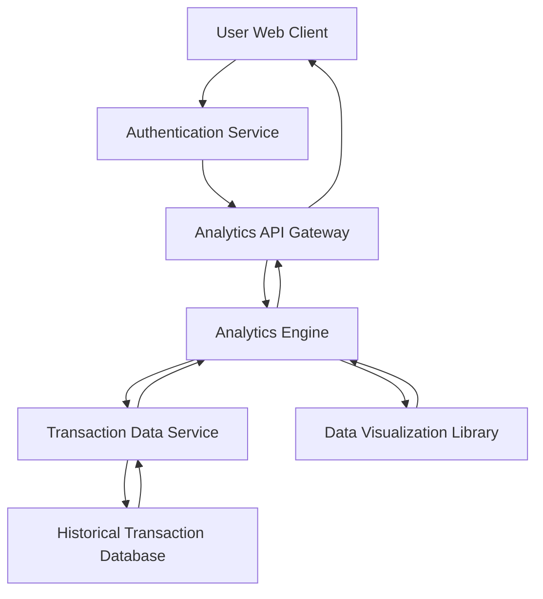

#### 1. High-Level Design

- **Summary:** This epic provides interactive visualizations and analytics for users to understand spending patterns across nine predefined categories (Food & Dining, Fuel, Shopping, Travel, Entertainment, Utilities, Healthcare, Education, Miscellaneous). It includes monthly spend trends and card-wise spend analysis to enable informed financial decisions.

- **Component Flow:**

- **Integration Points:**
  - Upstream: Transaction data service for raw transaction data
  - Upstream: Historical transaction database for time-series analysis
  - Upstream: Data visualization library for chart rendering
  - Downstream: Web/mobile client for interactive chart display

- **Key Assumptions:**
  - Transactions are pre-categorized or categorized in real-time using a classification service (category assignment mechanism not specified)
  - Monthly trends are calculated based on transaction timestamps aggregated by calendar month

- **NFR Highlights:** Visualizations must be interactive and responsive; analytics processing should support historical data analysis; charts must render efficiently for large transaction datasets

- **Data Flow:** User requests analytics view. The Analytics Engine queries the Transaction Data Service, which retrieves historical transaction data from the database. The engine processes transactions to calculate category-wise spending, monthly trends, and card-wise breakdowns. Processed data is formatted for visualization using the Data Visualization Library, then returned to the client as interactive charts and graphs enabling drill-down and filtering capabilities.

#### 2. Validation Report

- **Requirements Coverage:** The design addresses all scope elements including category-wise spending visualization, monthly spend trends analysis, card-wise spend analysis, interactive charts and graphs, and nine spending categories tracking. All dependencies (transaction data service, analytics engine, data visualization library, historical transaction database) are integrated. The architecture supports interactive and responsive visualizations with efficient rendering for large datasets as required by the NFRs.