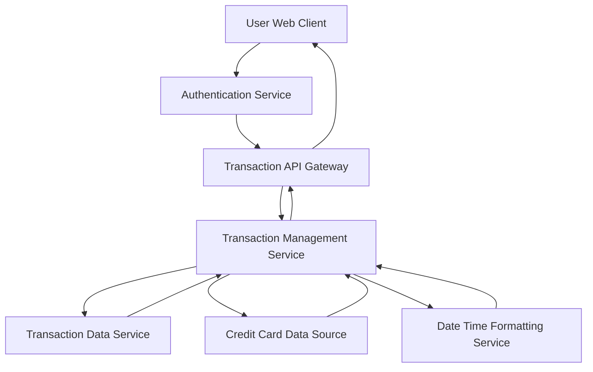

#### 1. High-Level Design

- **Summary:** This epic enables users to view and manage credit card transactions within the dashboard. Users can access detailed transaction information across all credit cards with support for transaction listing, filtering, search, and history access to provide complete transparency into spending activities.

- **Component Flow:**

- **Integration Points:**
  - Upstream: Transaction data service for transaction records
  - Upstream: Credit card data source for card identification and validation
  - Upstream: User authentication service for access control
  - Upstream: Date and time formatting service for consistent timestamp display
  - Downstream: Web/mobile client for transaction display interface

- **Key Assumptions:**
  - Transaction filtering supports common criteria (date range, amount, category, card) with server-side processing
  - Transaction details include standard fields (date, merchant, amount, category, card) with consistent data structure

- **NFR Highlights:** Transaction display must be responsive; system should efficiently handle large transaction volumes; transaction data must be displayed accurately and consistently

- **Data Flow:** User requests transaction view (optionally with filters/search criteria). The Transaction Management Service queries the Transaction Data Service for relevant transactions, validates card associations via the Credit Card Data Source, and formats timestamps using the Date Time Formatting Service. The service applies filtering and pagination logic, then returns structured transaction data to the client. The client renders transaction listings with detail views, supporting user navigation through transaction history across multiple cards.

#### 2. Validation Report

- **Requirements Coverage:** The design comprehensively covers the epic's scope including transaction listing, transaction details view, multi-card transaction support, transaction filtering and search, and transaction history access. All dependencies (transaction data service, credit card data source, user authentication service, date and time formatting service) are incorporated into the architecture. The design supports responsive display, efficient handling of large transaction volumes, and accurate/consistent data presentation as specified in the NFRs.