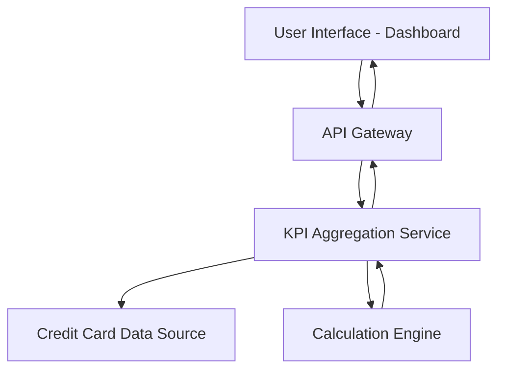

#### 1. High-Level Design

- **Summary**: This epic delivers a consolidated dashboard that displays key performance indicators (KPIs) for users' credit card portfolios, including monthly spend, total credit limit, available credit, and outstanding amounts across multiple cards. The dashboard provides a unified interface for monitoring overall credit card financial health.

- **Component Flow**:

- **Integration Points**: 
  - Upstream: Credit card data source for card details, balances, and credit limits
  - Downstream: User interface layer (web/mobile responsive clients)

- **Key Assumptions**: 
  - Credit card data source provides real-time or near-real-time data feeds with card balances and transaction summaries
  - KPI calculations (available credit, outstanding amounts) are performed server-side with results cached for performance

- **NFR Highlights**: Dashboard must be responsive across desktop, tablet, and mobile devices; Page load time should support real-time KPI calculation and display

- **Data Flow**: User accesses the dashboard through the UI, which sends a request via the API Gateway to the KPI Aggregation Service. The service retrieves card details, balances, and limits from the Credit Card Data Source, then invokes the Calculation Engine to compute monthly spend, available credit, and outstanding amounts. Aggregated KPIs are returned through the API Gateway and rendered on the dashboard for the user.

#### 2. Validation Report

- **Requirements Coverage**: The design fully covers the epic's stated scope including dashboard KPIs display, monthly spend tracking, credit limit calculation, available credit display, outstanding amount tracking, and multiple credit card view through a consolidated interface. The architecture supports responsive design requirements and real-time KPI calculation as specified in the NFRs.