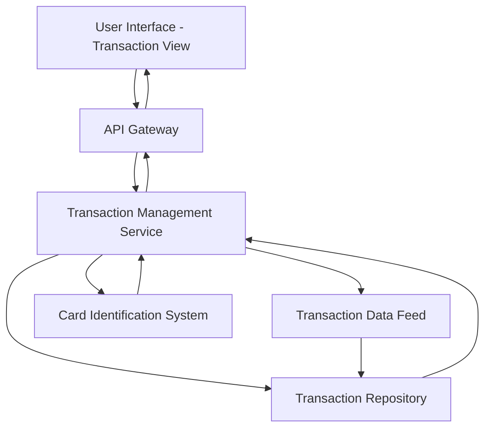

#### 1. High-Level Design

- **Summary**: This epic provides users with comprehensive transaction viewing and monitoring capabilities across all their credit cards. Users can access detailed transaction history from a centralized location, enabling spending tracking, expense management, and fraud detection across their entire card portfolio.

- **Component Flow**:

- **Integration Points**: 
  - Upstream: Transaction data feeds from credit card data sources; Card identification system for associating transactions with specific cards
  - Downstream: User interface for transaction display and interaction

- **Key Assumptions**: 
  - Transaction data feeds provide standardized transaction records with card identifiers, timestamps, amounts, and merchant details
  - Transaction history is stored in a queryable repository with indexing on card ID, date, and amount for efficient lookup

- **NFR Highlights**: System must handle transaction data efficiently; Interface must be responsive and support quick transaction lookup and display

- **Data Flow**: User requests transaction history through the UI, which routes the request via the API Gateway to the Transaction Management Service. The service queries the Transaction Repository (populated by Transaction Data Feeds) and uses the Card Identification System to filter and aggregate transactions by card. Transaction details are retrieved, formatted, and returned through the API Gateway to render in the user interface with full transaction history and details.

#### 2. Validation Report

- **Requirements Coverage**: The design addresses all requirements in the epic's scope including transaction viewing, transaction history display, multi-card transaction aggregation, and transaction details access. The architecture supports efficient transaction data handling and responsive interface requirements specified in the NFRs through appropriate service layering and data repository design.