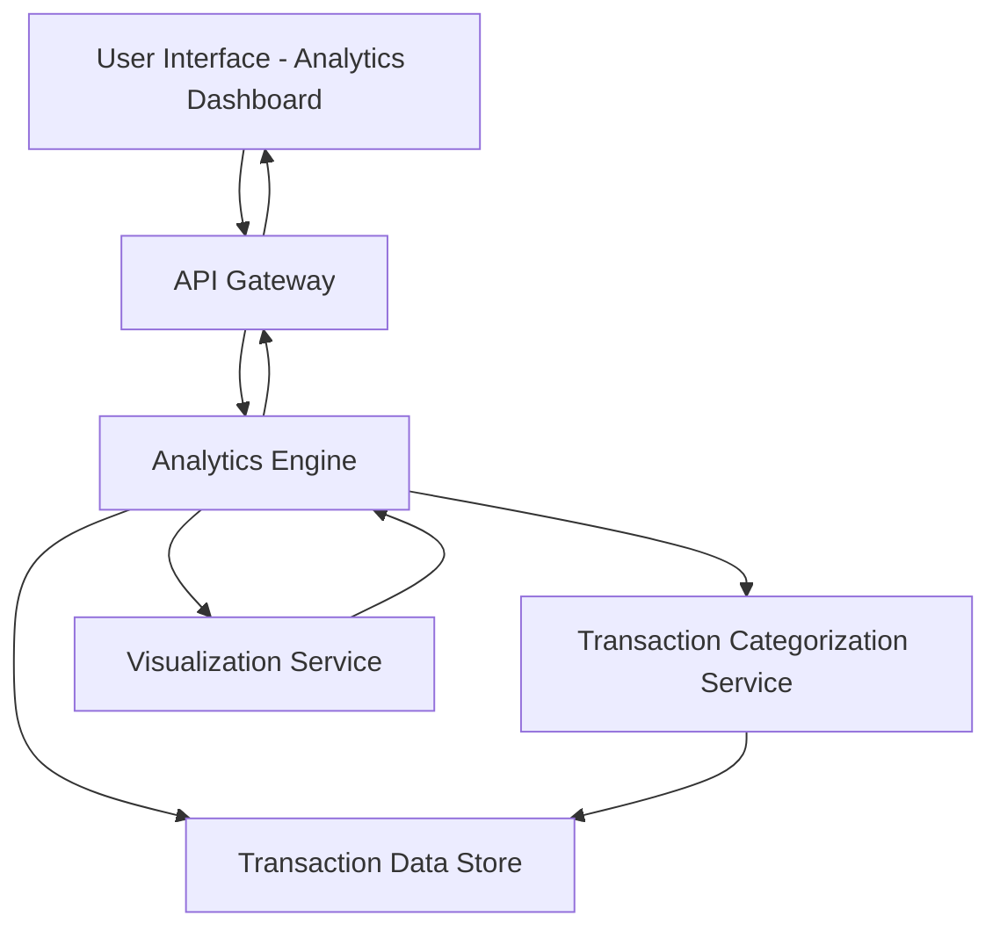

#### 1. High-Level Design

- **Summary**: This epic delivers interactive visualizations and analytical capabilities that enable users to understand spending patterns through monthly spend trends, card-wise analysis, and category-wise breakdowns across 9 predefined categories (Food & Dining, Fuel, Shopping, Travel, Entertainment, Utilities, Healthcare, Education, and Miscellaneous).

- **Component Flow**:

- **Integration Points**: 
  - Upstream: Transaction categorization engine/service for category mappings; Transaction data with category assignments
  - Downstream: Visualization libraries for interactive chart rendering; User interface for analytics display

- **Key Assumptions**: 
  - Transaction categorization service provides pre-categorized transactions or real-time categorization based on merchant codes or transaction descriptions
  - Analytics aggregations (monthly trends, card-wise, category-wise) are pre-computed or cached to ensure fast chart rendering

- **NFR Highlights**: Visualizations must be interactive and responsive; Analytics engine must efficiently process and aggregate spending data across multiple dimensions; Charts must render quickly for optimal user experience

- **Data Flow**: User accesses the analytics dashboard through the UI, sending requests via the API Gateway to the Analytics Engine. The engine retrieves categorized transaction data from the Transaction Data Store (with categories assigned by the Transaction Categorization Service), performs multi-dimensional aggregations (by month, card, and category), and passes results to the Visualization Service. The Visualization Service generates interactive charts and graphs that are returned through the API Gateway and rendered in the user interface, enabling users to explore spending patterns and insights.

#### 2. Validation Report

- **Requirements Coverage**: The design comprehensively covers the epic's scope including monthly spend trends visualization, card-wise spend analysis, category-wise spending analytics across all 9 predefined categories, interactive charts and graphs, and spending pattern identification. The architecture supports the NFR requirements for interactive/responsive visualizations, efficient multi-dimensional data processing, and quick chart rendering through appropriate service separation and data aggregation strategies.