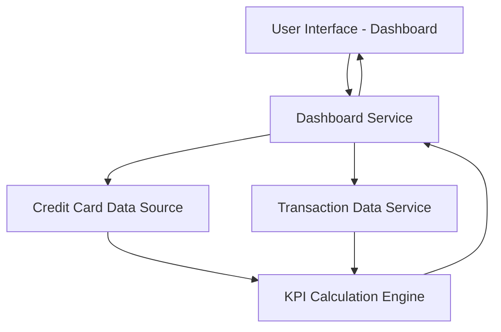

#### 1. High-Level Design

- **Summary:** This epic delivers a consolidated dashboard that displays key performance indicators (KPIs) across all user credit cards, including monthly spend, total credit limit, available credit, and outstanding amounts. The dashboard provides a unified view enabling users to monitor their financial position and make informed credit management decisions.

- **Component Flow:**

- **Integration Points:** 
  - Upstream: Credit card data source (for card details, limits, balances)
  - Upstream: Transaction data service (for monthly spend calculations)
  - Downstream: Provides consolidated KPI data to dashboard UI layer

- **Key Assumptions:** 
  - Credit card data is available via REST API or database query with standard fields (card_id, credit_limit, current_balance, outstanding_amount)
  - Monthly spend is calculated by aggregating transactions from the current calendar month

- **NFR Highlights:** Dashboard must be responsive across desktop, tablet, and mobile devices; Page load time must support real-time KPI updates; System must handle multiple credit cards per user

- **Data Flow:** User accesses the dashboard UI, which requests KPI data from the Dashboard Service. The service retrieves card details (limits, balances) from the Credit Card Data Source and transaction data from the Transaction Data Service. The KPI Calculation Engine aggregates this data to compute monthly spend, available credit, and outstanding amounts. Calculated KPIs are returned to the Dashboard Service and rendered in the UI as consolidated metrics across all cards.

#### 2. Validation Report

- **Requirements Coverage:** The design covers all stated scope items: monthly spend display, total credit limit aggregation, available credit calculation, outstanding amount tracking, multi-card consolidated view, and responsive dashboard layout. The component architecture supports the NFRs for responsiveness, real-time updates, and multi-card handling. Integration points align with stated dependencies on credit card and transaction data sources.