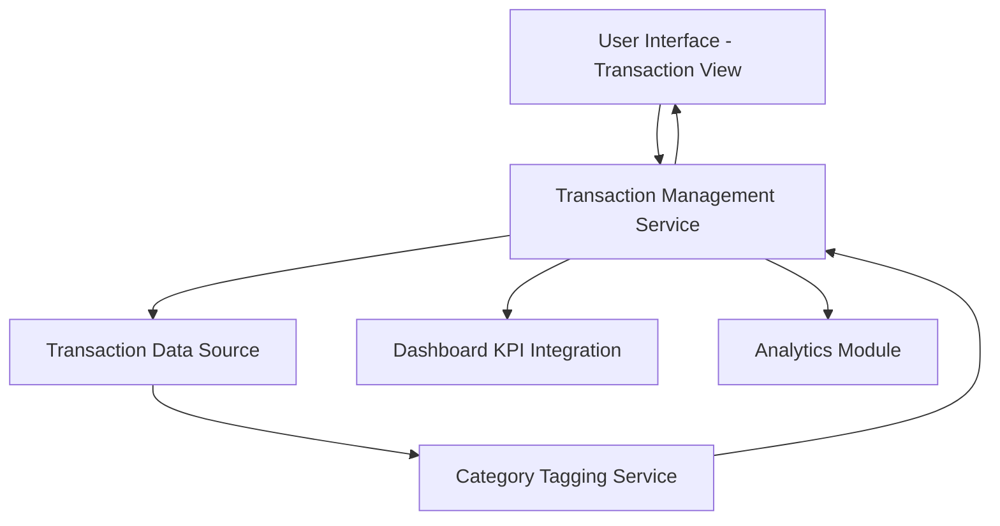

#### 1. High-Level Design

- **Summary:** This epic enables users to view and manage credit card transactions across multiple cards. It provides detailed transaction records that feed into dashboard analytics, offering transparency into credit utilization. The transaction management capability forms the foundation for spending analysis and category-wise insights.

- **Component Flow:**

- **Integration Points:**
  - Upstream: Transaction data source or service (provides raw transaction records)
  - Downstream: Integrates with dashboard KPIs for spend calculations
  - Downstream: Feeds data to analytics module for category-wise analysis

- **Key Assumptions:**
  - Transactions are retrieved via API or database with fields including transaction_id, card_id, amount, date, merchant, and category
  - Category tagging is performed automatically at transaction ingestion or via a separate categorization service

- **NFR Highlights:** System must support retrieval and display of transaction history; Transaction data must be accurately categorized for analytics; Interface must handle high volume of transaction records efficiently

- **Data Flow:** User accesses the transaction view UI, which requests transaction data from the Transaction Management Service. The service retrieves transaction records from the Transaction Data Source, which are processed by the Category Tagging Service to assign spending categories. Categorized transactions are returned to the UI for display and simultaneously fed to the Dashboard KPI Integration for spend calculations and to the Analytics Module for category-wise analysis and pattern identification.

#### 2. Validation Report

- **Requirements Coverage:** The design addresses all scope items: transaction listing, multi-card transaction view, transaction details display, and transaction data integration with dashboard KPIs. The architecture supports NFRs for transaction history retrieval, accurate categorization, and efficient handling of high-volume records. Integration points match stated dependencies on transaction data sources, dashboard KPI integration, and analytics module data feeds.